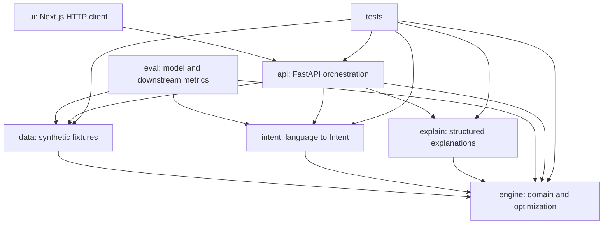

# CardIQ — Technical Design Reference

This is the engineering design record for the project: the invariants that constrain every
module, the shared data contracts, the rationale behind the harder calls, and the failure-mode
contract. The [`README`](README.md) is the pitch and quickstart; this file is the depth behind it.
Each module's `IMPLEMENTATION.md` owns the detailed design inside that module's boundary — if a
module guide conflicts with this file, this file wins.

## Contents

- [A. Repository guide](#a-repository-guide)
- [B. Non-negotiable invariants](#b-non-negotiable-invariants)
- [C. Dependency direction](#c-dependency-direction)
- [D. Contracts and data models](#d-contracts-and-data-models)
- [E. Design rationale](#e-design-rationale)
- [F. Failure modes and reliability contract](#f-failure-modes-and-reliability-contract)
- [G. Original product framing](#g-original-product-framing)

---

## A. Repository guide

| Area | Guide | Owns |
|---|---|---|
| Deterministic engine | [engine/IMPLEMENTATION.md](engine/IMPLEMENTATION.md) | Domain models, scoring, feasibility, recommendation, greedy allocation, ILP, frontier, what-if |
| Synthetic scenarios | [data/IMPLEMENTATION.md](data/IMPLEMENTATION.md) | Card catalog, Sarah scenario, validated fixture loading |
| Intent parser and SFT data | [intent/IMPLEMENTATION.md](intent/IMPLEMENTATION.md) | Provider boundary, validation/fallback, reverse data generation, Freesolo integration |
| Explanation layer | [explain/IMPLEMENTATION.md](explain/IMPLEMENTATION.md) | Faithful structured decision cards and comparisons |
| HTTP API | [api/IMPLEMENTATION.md](api/IMPLEMENTATION.md) | FastAPI request/response contracts and application wiring |
| Web UI | [ui/IMPLEMENTATION.md](ui/IMPLEMENTATION.md) | Next.js dashboard and optimizer; no financial recomputation |
| Model evaluation | [eval/IMPLEMENTATION.md](eval/IMPLEMENTATION.md) | Frozen comparisons and downstream solver-verification metrics |
| Test strategy | [tests/IMPLEMENTATION.md](tests/IMPLEMENTATION.md) | Test layers, fixtures, brute-force oracle, integration gates |
| Product provenance | [data/SOURCES.md](data/SOURCES.md) | Card product sourcing and verification dates |

Shared domain types live in `engine/models.py`; HTTP wrappers live in `api/schemas.py`; UI view
models remain untyped objects received from the API. A contract change updates
`engine/models.py`, [section D](#d-contracts-and-data-models) below, the owning tests, and every
affected module guide in the same change — don't let a second definition of a shared model grow
in another module just to avoid an import.

## B. Non-negotiable invariants

1. The optimization engine is deterministic. Machine learning parses language only.
2. Currency and currency-derived values use integer cents or millicents. Rates use integer basis points. No binary float may enter reward, utilization, bonus, cashflow, or solver arithmetic.
3. Intent weights arrive as finite JSON numbers. The parser/domain model validates and normalizes them for interchange; `engine/objective.py` then converts them exactly once to nonnegative integer parts-per-million summing to `1_000_000` before any score or solver arithmetic.
4. Raw measurements and optimization utility are different concepts. The engine preserves auditable raw values, maps them through documented integer calibration functions, then applies intent weights. Explanations show raw values, not invented monetary interpretations of utility points.
5. Credit limits, locked assignments, active utilization ceilings, and requested must-hit bonuses are hard constraints. Cashback, travel value, ordinary bonus preference, cashflow, credit-health preference, and risk preference are soft objectives.
6. A solver result is labeled `optimal` only when enumeration or CBC proves optimality. Greedy results are `heuristic`; timeout/error fallback results are `heuristic_fallback`; ILP-proven or analytically proven contradictions are `infeasible`; and a heuristic dead end without proof is `unresolved`.
7. Explanations are templates over solver output. No LLM writes, edits, or verifies financial reasoning.
8. All people, account states, transactions, bonus progress, and payment workflows are synthetic. Card product names and ordinary reward terms may be timestamped public reference data from official issuer pages. No credentials, card numbers, real PII, or real-money movement enters the system.
9. The UI never reimplements scoring. It renders structured API output and submits user edits back to the API.
10. The sampled strategy frontier is not claimed to be the complete mathematical Pareto frontier. It is a deterministic, coarse weight sweep followed by exact dominance filtering over the plans that were sampled.

## C. Dependency direction



These arrows are one-way and enforced by an AST-walking test, not just convention. In particular,
`engine` must not import `intent`, `explain`, `api`, `ui`, `eval`, or `data`; `intent` must not
call an optimizer; and `explain` must not recompute scores.

## D. Contracts and data models

This section is the shared boundary between modules: ownership, canonical semantics, and
serialized shapes. It is deliberately stricter than a sketch — implementation can evolve
internally as long as these observable contracts stay stable.

### D1. Contract ownership

| Contract | Canonical implementation | Consumers |
|---|---|---|
| Card, purchase, bonus, goal, constraints, intent | `engine/models.py` | All modules |
| Weight quantization and objective utility | `engine/objective.py` | Recommender and allocators |
| Feasibility and issue codes | `engine/feasibility.py` | Recommender, allocators, API, explain |
| Optimization results and metrics | `engine/models.py` | Explain, API, eval |
| Parser metadata and fallback state | `intent/models.py` | API, UI, eval |
| Explanation blocks | `explain/models.py` | API, UI |
| HTTP request and response wrappers | `api/schemas.py` | UI and API tests |
| Public product provenance and synthetic account/scenario documents | `data/models.py` | Data loaders, API, UI, eval |

### D2. Primitive representations

**Money and value**

- Currency is an integer number of cents: `220000` means `$2,200.00`.
- Point values are integer millicents per point: `1250` means `1.25` cents per point.
- Rates and utilization are integer basis points: `300` means `3%`; `2750` means `27.50%`.
- Intent weights enter the engine as integer parts-per-million: `450000` means `45%` of preference weight.
- Dates serialize as ISO 8601 calendar dates, for example `2026-10-18`.
- IDs are stable, opaque, nonempty ASCII strings, compared case-sensitively.
- Display formatting happens only in the explanation/UI layers.

The parser may temporarily use finite decimal/float JSON values because JSON has one number type.
It must reject `NaN`, infinity, negative values, and an all-zero vector. The exact sequence is:
provider/API JSON numbers → strict parser/domain validation → normalized interchange `Intent` →
one conversion in `engine/objective.py` to ppm → integer-only objective and solver arithmetic. No
parser/provider independently invents ppm fields.

Every domain Pydantic model uses `ConfigDict(extra="forbid")`. Integer money/rate/day fields use
`StrictInt` or `Field(strict=True)` so they reject floats, booleans, and numeric strings instead
of coercing them. Date fields still accept ISO strings from fixture/API JSON. Intent weights are
the documented numeric-interchange exception and receive explicit finite-number validation.

**Rounding**

- Reward accrual floors at the final integer division required by the reward rule.
- Point conversion floors after multiplying accrued points by millicents-per-point.
- Utilization uses floor division for reporting, but hard feasibility uses cross multiplication to avoid accepting an amount merely because displayed bps rounded down.
- Weight quantization uses `Decimal(str(value))` and largest remainder so all six ppm values sum exactly to `1_000_000`.
- Display percentages and dollars may use `Decimal`; they never feed back into optimization.

### D3. Canonical domain models

The examples below are JSON shapes. Python uses Pydantic v2 and string enums.

**RewardRule**

```json
{ "category": "groceries", "rate_bps": 400, "reward_type": "points" }
```

`category` is normalized lowercase snake case. `rate_bps` is nonnegative. `reward_type` is one of
`cashback`, `points`, or `miles`. A card cannot contain duplicate rule categories. The first exact
category match is used; if none matches, `base_rate_bps` and the card's `base_reward_type` are
used. A rule for `other` is ordinary category data, not a second fallback mechanism.

**SignupBonus**

```json
{ "spend_required_cents": 400000, "spend_so_far_cents": 125000, "reward_value_cents": 60000, "deadline_date": "2026-10-31" }
```

All values are nonnegative. `spend_so_far_cents` may exceed the requirement in imported data; the
engine clamps remaining spend to zero without changing source data. Planned purchases count only
when their date is on or before the deadline. Every purchase category is treated as
bonus-eligible.

**Card**

```json
{
  "id": "summit-journey", "name": "Summit Journey (synthetic)",
  "credit_limit_cents": 1200000, "current_balance_cents": 85000,
  "reward_rules": [], "base_rate_bps": 100, "base_reward_type": "points",
  "point_value_millicents": 1250, "annual_fee_cents": 9500,
  "statement_day": 12, "due_day": 7, "signup_bonus": null
}
```

Limits, balances, rates, values, and fees are nonnegative integers. A zero-limit card validates as
input but is infeasible for new purchases. `statement_day` and `due_day` are between 1 and 28
inclusive. `current_balance_cents` greater than the limit is valid imported state but makes new
assignments infeasible and produces an issue. `point_value_millicents` is used only for
point/mile rules — cashback already represents cents. `annual_fee_cents` is metadata and a
disclosed sunk-cost assumption, not a monthly assignment factor.

**Purchase**

```json
{ "id": "rent-2026-08", "amount_cents": 220000, "category": "rent", "date": "2026-08-01", "is_recurring": true, "locked_card_id": null }
```

Amount must be a positive integer. Category normalization matches reward-rule normalization.
Purchase IDs are unique inside a request. A lock references a card in the same request; unknown
locks produce structured infeasibility, not a low-level key error. Purchases are indivisible —
never split across cards.

**Goal and Intent**

The six and only six goal keys: `max_cashback`, `max_travel`, `credit_health`,
`hit_signup_bonus`, `max_cashflow`, `min_risk`.

```json
{
  "weights": { "max_cashback": 0.10, "max_travel": 0.10, "credit_health": 0.45,
               "hit_signup_bonus": 0.25, "max_cashflow": 0.05, "min_risk": 0.05 },
  "constraints": { "max_utilization_bps": 3000, "max_utilization_until": "2026-11-01",
                    "must_hit_bonus_card_ids": ["harbor-bonus"] }
}
```

All six keys are present after parser normalization. Every value is finite and nonnegative, and
the vector contains at least one positive value. `Intent` normalizes values for ergonomic API
interchange; `objective.py` alone produces canonical ppm immediately before any
recommendation/allocation scoring. `max_utilization_bps` is absent or between `0` and `10000`.
`max_utilization_until` requires `max_utilization_bps`; a ceiling without a date applies to the
full planning horizon. `must_hit_bonus_card_ids` is unique and stable-sorted after validation, and
request-level validation checks that forced-bonus IDs exist and have bonuses.

`max_utilization_bps` is a per-card ceiling, not portfolio-wide utilization — total portfolio
utilization does not change when a fixed total purchase amount moves among cards, so per-card
concentration is the meaningful assignment constraint.

### D4. Raw factors and objective utility

Every candidate or assignment exposes raw facts separately from utility contributions.

```json
{
  "cashback_cents": 0, "travel_value_cents": 3300,
  "signup_eligible_spend_cents": 220000, "signup_progress_cents": 220000,
  "signup_bonus_earned_cents": 0, "signup_goal_points": 30000,
  "cashflow_days": 37, "cashflow_value_cents": 111,
  "utilization_before_bps": 708, "utilization_after_bps": 2541,
  "credit_penalty_points": 0, "risk_penalty_points": 0
}
```

Raw fields are exact under documented assumptions. `signup_progress_cents` is spend progress, not
reward money; `signup_bonus_earned_cents` is nonzero only if the evaluated plan reaches the
threshold by the deadline.

```json
{
  "utility_by_goal": { "max_cashback": 0, "max_travel": 82500000, "credit_health": -12000000,
                        "hit_signup_bonus": 30000000, "max_cashflow": 2775000, "min_risk": 0 },
  "total_utility": 103275000
}
```

These values are integer comparison units, not cents and not user-facing money:
$U_g = w_g^{ppm} \times f_g(raw, config)$. The common factor of one million does not need to be
divided out for ranking. Calibration functions and constants live in `engine/config.py`; both
greedy and ILP implementations use the same configuration.

| Goal | Positive signal | Negative signal |
|---|---|---|
| `max_cashback` | Cashback cents | None |
| `max_travel` | Static cents value of points/miles | None |
| `credit_health` | None | Convex aggregate per-card utilization penalty |
| `hit_signup_bonus` | Capped progress utility plus earned bonus value | None |
| `max_cashflow` | Carry-value cents and reported float days | None |
| `min_risk` | None | Near-limit headroom penalty; never duplicates a hard violation |

Hard violations are excluded before scoring — a huge risk penalty is not a substitute for a
constraint.

### D5. Feasibility contract

The shared analyzer receives cards, purchases, constraints, and optionally a proposed assignment
map. It returns issues and per-card slack; the optimizer does not duplicate these rules. Checks
run in this order so diagnostics are deterministic:

1. Duplicate IDs and unknown card references.
2. Locked purchase validity.
3. Individual purchase capacity.
4. Full-horizon card credit limits.
5. Active dated or full-horizon per-card utilization ceilings.
6. Forced bonus existence, deadline eligibility, available eligible spend, and capacity.

For a dated utilization ceiling:

$$10000 \times (current\ balance + eligible\ assigned\ spend) \leq max\ utilization\ bps \times credit\ limit$$

This cross-multiplied comparison is exact. Eligibility is inclusive:
`purchase.date <= max_utilization_until`. If no purchase in the evaluated horizon is on/before the
cutoff, that dated ceiling is inactive for routing; all assigned spend still remains subject to
the full credit limit. A ceiling without a cutoff applies to the full horizon.

**Stable issue codes**

| Code | Meaning |
|---|---|
| `duplicate_id` | Duplicate card or purchase ID |
| `unknown_locked_card` | Purchase lock references an absent card |
| `unknown_purchase` | What-if or assignment input references an absent purchase |
| `unknown_assigned_card` | Assignment references an absent card |
| `missing_assignment` | A purchase has no assignment entry |
| `purchase_locked_to_other_card` | Assignment/candidate conflicts with a valid purchase lock |
| `unknown_bonus_card` | Forced bonus references an absent card |
| `card_has_no_bonus` | Forced card has no signup bonus |
| `zero_credit_limit` | Card cannot accept spend |
| `card_already_over_limit` | Imported balance is already above limit |
| `purchase_exceeds_capacity` | One purchase cannot fit a required/available card |
| `credit_limit_exceeded` | Proposed aggregate spend exceeds a card limit |
| `utilization_ceiling_exceeded` | Proposed dated/full-horizon spend breaches the ceiling |
| `bonus_deadline_passed` | A forced bonus cannot receive eligible planned spend |
| `bonus_target_unreachable` | Eligible purchases/capacity cannot satisfy forced remaining spend |
| `no_feasible_assignment` | No complete indivisible assignment exists |
| `heuristic_dead_end` | Greedy and bounded repair did not find a complete plan; feasibility is unproven |
| `solver_timeout` | Exact solve did not finish in the configured limit |
| `solver_error` | Exact solver failed unexpectedly |

Normal exact solves are isolated behind a caller-side wall-clock watchdog. The configured limit is
1–60 seconds; timeout or native worker failure cannot block the API indefinitely and returns an
honestly labeled greedy fallback when available. Sampled-frontier solves inherit the smaller
remaining total frontier budget. Every issue contains `code`, `message`, affected card/purchase
IDs, optional integer `actual`, optional integer `required`, and a concrete `suggestion`.

### D6. Optimization results

`status` is one of:

- `optimal` — complete single-purchase enumeration or CBC proved the modeled optimum.
- `heuristic` — requested greedy/local-search result.
- `heuristic_fallback` — greedy result returned because exact solving timed out or errored.
- `infeasible` — enumeration, an analytical contradiction, or CBC proved no complete assignment satisfies all hard constraints.
- `unresolved` — a heuristic failed to complete an assignment and no infeasibility proof is available.

`solver_method` is `single_purchase`, `greedy`, or `ilp`. An ILP request that falls back reports
`solver_method=greedy`, `status=heuristic_fallback`, and includes the exact-solver issue.

For a monthly plan, `alternatives` are computed by the optimizer against the final complete
assignment: move this one purchase to another card, keep all other assignments fixed, and
recompute feasibility and aggregate metrics. Feasible alternatives sort by descending resulting
plan utility then card ID; infeasible alternatives follow in card-ID order with issue codes. The
explanation layer consumes these values and never reconstructs a stateless comparison.

Monthly `PurchaseAssignment.raw_factors` contains additive reward/cashflow facts and the card's
final ending utilization for context. Aggregate signup progress/completion and credit/risk
penalties remain in card summaries and allocation metrics rather than being arbitrarily attributed
to individual purchases — per-purchase objective contributions do not sum to the plan objective;
the plan objective is authoritative. `utilization_slack_cents` is null when no hard utilization
ceiling applies; zero means binding.

For `infeasible` or `unresolved`, assignment and summary lists are empty and issues are nonempty.
`projected_reward_value_cents` equals cashback plus static travel value plus signup bonuses
actually reached — it does not include signup progress utility or cashflow carrying value.

**Sampled frontier.** Frontier metadata distinguishes `active_goal_ids` (all goals with positive
original weight) from `swept_goal_ids` (the top two or three actually varied). Dominance compares
one unweighted, direction-aware metric per swept goal only — never blended total utility, and
never claims coverage over non-swept goals:

| Goal | Frontier metric | Direction |
|---|---|---|
| `max_cashback` | `cashback_cents` | Maximize |
| `max_travel` | `travel_value_cents` | Maximize |
| `credit_health` | `credit_penalty_points` | Minimize |
| `hit_signup_bonus` | `signup_goal_points` | Maximize |
| `max_cashflow` | `cashflow_value_cents` | Maximize |
| `min_risk` | `risk_penalty_points` | Minimize |

**Single-purchase recommendation.** The result contains `winner`, optional `runner_up`, all
feasible ranked candidates, excluded cards with issue codes, and warnings. If no card is feasible,
status is `infeasible` and winner is null. Locked purchases evaluate only the locked card while
still returning why invalid alternatives were excluded.

### D7. Parser contract

The provider boundary returns raw text; it never constructs engine objects directly:
`IntentProvider.generate(text, reference_date) -> ProviderResponse`. `ProviderResponse` contains
raw output, provider name, model ID, latency, and optional request metadata — it never stores an
API key.

Post-processing, in order: extract one JSON object (including from a fenced response) → parse
without permissive `NaN` support → map known goal keys, reject unknown constraint fields → fill
omitted goal keys with zero → validate constraints and all numeric values → normalize positive
weights and create `Intent` → return source metadata and warnings.

On terminal failure, demo mode creates equal importance by assigning `1.0` to each goal before
normalizing and returns no constraints with `used_fallback=true`. Canonical engine ppm becomes
`166667` for the first four goals in enum order and `166666` for the last two, totaling exactly
`1_000_000`. Eval mode raises a typed parse failure so invalid-JSON rate remains measurable.
Relative dates are never guessed in post-processing; prompts include `reference_date` and require
absolute ISO output.

### D8. Explanation contract

The explanation builder consumes only optimization results, cards, purchases, and intent — it
does not import scoring helpers. Structured output includes a headline with chosen card and
purchase/plan context; positive and caution factor lines with machine-readable factor kind; raw
amount, unit, formatted text, and source field for every line; an alternative comparison
identifying the next feasible card or explaining exclusion; binding and near-binding constraint
lines based on engine-provided slack; and solver-status disclosure and warnings. The builder must
never say a partial signup progress amount was earned, attach confidence to deterministic math, or
describe a heuristic result as optimal.

### D9. API contract

All endpoints return HTTP 200 for valid requests even when the domain result is infeasible.
FastAPI uses 422 for malformed request structure and 503 only when an explicitly required external
provider is unavailable and fallback is disabled.

| Endpoint | Request | Response payload |
|---|---|---|
| `GET /demo-scenario` | none | Sarah's synthetic scenario and named manual intent presets |
| `POST /parse-intent` | text, required reference date, card context/scenario, optional allowed provider | Parse result with intent/source/warnings |
| `POST /recommend` | cards, purchase, intent | Recommendation plus explanation |
| `POST /allocate` | cards, purchases, intent, solver preference | Allocation plus explanation blocks |
| `POST /frontier` | cards, purchases, intent, max points | Sampled frontier metadata and plans |
| `POST /what-if` | base scenario, purchase ID, override card ID, solver preference | Base/override summaries and integer deltas |
| `GET /health` | none | Process, fixture, solver, and provider readiness |

Every response uses a top-level envelope: `{"schema_version": "1.0", "data": <endpoint payload>, "warnings": []}`.
Domain warnings may also remain inside a result when tied to that result; envelope warnings
describe orchestration/provider behavior. Deterministic endpoints do not add random IDs or
timestamps, so equal inputs canonicalize to byte-for-byte equal JSON.

### D10. Evaluation contract

Evaluation never uses parser fallback. Each model runner is named and produces cached raw
responses; all runners receive the same system contract, reference date, and held-out examples.

Headline downstream match uses a fixed suite of single-purchase probes spanning rent, grocery,
dining, and travel. For each held-out intent, compare the card selected from predicted intent
against the card selected from gold intent, and report monthly per-purchase assignment agreement
separately rather than collapsing it into the headline metric. Required report columns: valid
JSON/schema rate, six-goal macro mean absolute error, constraint field exact match and per-field
precision/recall/F1, downstream top-card match with bootstrap 95% interval, monthly assignment
agreement, and provider/model identity, sample count, dataset hash, prompt version, and fallback
count (must be zero).

### D11. Determinism rules

- Input lists are canonicalized by stable IDs before tie-breaking.
- Recommendation ties prefer lexicographically smaller card IDs.
- Greedy ordering is locked purchases first, then descending amount, then purchase ID.
- Local search scans purchase IDs then card IDs in stable order and accepts only strict utility improvement.
- ILP multiplies primary utility by a proven bound larger than the complete secondary tie score before adding deterministic tie coefficients. The implementation asserts the resulting coefficient/objective bound is below `2**53` for CBC's numeric representation under accepted inputs; otherwise it uses a two-pass primary-then-secondary solve or returns a typed solver error rather than silently risking a changed primary optimum.
- Frontier assignment keys sort `(purchase_id, card_id)` pairs.
- Synthetic generation and bootstrap evaluation require explicit seeds.

---

## E. Design rationale

This section records the reasoning behind decisions that are easy for independent readers (or
future contributors) to interpret differently, so every simplification stays explicit and
internally consistent.

### E1. Executive verdict

The central architecture is sound:

- Reward accrual, balance capacity, utilization, deadlines, and payment timing are deterministic calculations and belong in code/optimization, not ML.
- Natural-language intent is uncertain and belongs behind a validated model boundary.
- A solver can evaluate whether parser error changes an actual decision, making downstream match a useful task metric.
- Structured templates are more faithful than generated prose for financial explanations.
- Monthly allocation is a more differentiated deliverable than a single-card recommendation.

Five areas needed correction before an exactness claim was defensible, and the design below
resolves all five without invalidating the core idea: objective values used incompatible units
without calibration; static per-purchase ILP coefficients could not represent aggregate
utilization or all-or-nothing bonus completion; a greedy allocator was described as guaranteed
even though greedy search can dead-end on a feasible instance; a weighted sweep was described as
the Pareto frontier even though it samples only supported solutions and may miss integer frontier
points; and temporal balance behavior was under-specified relative to statement dates.

### E2. Decision table

| ID | Question | Decision | Reason |
|---|---|---|---|
| D001 | Are reward calculations learned? | No; pure integer functions | Rates and balances are known inputs, not predictions |
| D002 | What may the LLM output? | Only `Intent` weights and hard constraints | Keeps uncertain language outside the money path |
| D003 | What numeric form do intent weights use in the engine? | Integer ppm summing to `1_000_000` | Prevents float propagation and gives deterministic ties |
| D004 | How are different objectives compared? | Raw facts map to documented integer utility, then weights apply | Cents, bps, and days are not directly commensurate |
| D005 | What does utilization ceiling mean? | Per-card hard ceiling | Overall utilization is invariant to routing a fixed spend total |
| D006 | Do statements reset balances? | No | Payments and historical ledger are absent; pretending to reset would be less correct |
| D007 | What do statement dates affect? | Interest-free float calculation only | This is supportable from the available fields |
| D008 | Are annual fees part of routing? | No; display as sunk portfolio metadata | The month cannot avoid a fee on a card the user already holds |
| D009 | When is a signup bonus displayed as reward? | Only when the plan reaches it by the deadline | Partial progress is not earned money |
| D010 | Can partial bonus progress influence routing? | Yes, through a capped 20% utility pool | Prevents zero incentive until the threshold while limiting double counting |
| D011 | Is greedy failure proof of infeasibility? | No; return `unresolved` absent proof | Heuristic completeness is not guaranteed |
| D012 | When can the product say optimal? | Enumeration for one purchase or CBC optimal status | Honest claim tied to a proof-producing method |
| D013 | What is the frontier? | A sampled strategy frontier with exact dominance filtering over sampled plans | Weighted sweeps can miss nondominated integer solutions |
| D014 | What is parser fallback? | Equal weights/no constraints plus visible warning | Matches the original contract; manual correction keeps it honest |
| D015 | Does eval permit fallback? | Never | Otherwise model attribution and valid-output rates are corrupted |
| D016 | Does the UI calculate scores? | Never | Prevents drift from engine behavior |
| D017 | Can one purchase be split? | No | Matches real card routing and keeps the assignment model tractable |
| D018 | Are point values dynamic? | No; static per synthetic card | Award inventory and redemption modeling are explicit non-goals |
| D019 | Does bonus value receive a continuous deadline-urgency multiplier? | No | Deadline eligibility and completion already provide temporal behavior; an extra curve is uncalibrated and complicates exact ILP parity |
| D020 | Where are intent weights quantized? | `engine/objective.py`, once | Parser/domain validation owns interchange normalization; optimizer owns ppm arithmetic |

### E3. Objective soundness

Consider a reward of `4,400` cents, an ending utilization of `3,400` bps, and `35` float days.
Multiplying each directly by a user weight implies a basis point, a cent, and a day share the same
scale — a small numerical change in one factor could overwhelm a high stated weight in another.
The engine therefore keeps two layers: **raw facts** (exact cents, bps, spend progress, days used
for metrics and explanations) and **utility points** (integer, documented calibration outputs used
only for ranking and solving).

Default calibration: cashback and travel each earn 1 utility point per value cent; cashflow earns
1 utility point per carrying-value cent at 500 annual bps; signup progress earns up to 20% of
bonus value proportional to remaining spend completed, with the remaining 80% on-time completion;
credit health has no incremental penalty through 30% utilization, then convex slopes per bps
across 30–50%, 50–75%, 75–100%, and above 100% imported state; minimum risk penalizes ending
credit headroom shortfall below a configured reserve, one-for-one in cents. These slopes are
reviewable defaults calibrated against the Sarah scenario, not universal truths or validated
financial advice — snapshot tests protect them from accidental drift.

Cashback, travel value, and cashflow are additive by purchase-card pair. Utilization penalty, risk
headroom, and bonus completion are aggregate by card:

$$U(plan) = \sum_{p,c} x_{p,c} U_{additive}(p,c) - \sum_c U_{util}(ending_c) - \sum_c U_{risk}(ending_c) + \sum_c U_{bonus}(eligibleSpend_c)$$

Greedy candidate selection calculates the change in this plan-level utility when a purchase moves;
the ILP introduces aggregate variables for the nonlinear pieces. Reusing a static
`factor_breakdown(card, purchase)` as the entire monthly coefficient would be simpler but
logically wrong.

### E4. Financial arithmetic

**Rewards.** Cashback: $rewardCents = \lfloor amountCents \times rateBps / 10000 \rfloor$. Points:
$points = \lfloor amountCents \times rateBps / 10000 \rfloor$, then
$valueCents = \lfloor points \times pointValueMillicents / 1000 \rfloor$ — `300` bps means 3
points per dollar for a point rule.

**Utilization.** Reported utilization may floor to integer bps, but hard feasibility uses cross
multiplication rather than the floored display value. A zero-limit card is valid input for
diagnostics but infeasible for new spend. Aggregate portfolio utilization after assigning a fixed
set of purchases is $(\sum balances + \sum purchases) / \sum limits$ and does not change based on
which card receives each purchase — useful display context, but it cannot distinguish
allocations.

**Cashflow.** The next statement close is the first card statement day on or after the purchase
date; the due date is the first card due day strictly after that close. A purchase on the close
day is treated as appearing on that close (conservative). Float days are the calendar-day
difference from purchase to due date. Carrying value is
$\lfloor amountCents \times annualCarryBps \times floatDays / (10000 \times 365) \rfloor$ —
opportunity-cost utility, not card interest or guaranteed earnings.

**Signup bonus.** Only spend dated on/before the deadline is eligible; every category counts. The
bonus value is static synthetic value. If a forced bonus is already achieved, the constraint is
satisfied and adds no new completion reward — the existing reward is not attributed to this plan.

### E5. Temporal-model limitations

The input lacks transaction posting timestamps, payment events, statement balances, grace-period
state, and account opening date, so a fully faithful ledger simulator is out of scope. The model
assumes: `current_balance_cents` remains outstanding throughout the planning horizon; every
planned purchase immediately consumes available credit; a dated utilization ceiling counts current
balance plus purchases dated through the cutoff; purchases after the cutoff still count toward the
credit limit and ending utilization but not that dated ceiling; statement day changes float timing
only; and due day does not imply an automatic payment. These assumptions are conservative for
capacity and transparent about their limits — adding payments without payment amounts and dates
would create false precision.

### E6. Search and solver review

**Single purchase.** Enumerating all cards is exact for one indivisible purchase; stable card-ID
tie-breaking makes equal-input outputs deterministic. This result may be labeled `optimal` within
the modeled objective and constraints.

**Greedy monthly allocation.** Largest-first assignment tends to protect capacity for expensive
purchases but can still choose an early card that blocks a later locked or bonus-critical
assignment. Locked purchases are placed first; candidate ordering uses marginal plan utility and a
stable tie-break; a bounded repair phase relocates one or two prior purchases when a dead end
occurs. Even with repair, failure is not a proof: `heuristic` for a complete feasible plan,
`infeasible` only when an analytical contradiction is proven (a locked purchase exceeding card
capacity, or total purchases exceeding total available capacity), and `unresolved` when search
ends without a complete plan and no proof exists.

**Exact ILP.** Binary assignment variables represent indivisible purchase routing. Additive
rewards and cashflow are constant coefficients; dated ceilings are linear. Aggregate
utilization/risk and bonus utility use capped sets of reachable spend totals with one binary state
selected per card, every coefficient precomputed by the same pure Python evaluator — scenarios
exceeding the state cap fall back honestly rather than approximating. CBC optimal status supports
an `optimal` label; CBC infeasible status supports an `infeasible` label. A timeout with an
incumbent is not proven optimal, so the engine returns the independently verified greedy plan as
`heuristic_fallback` with the timeout issue attached, rather than exposing an ambiguous incumbent.

**Frontier.** Weighted sums find supported solutions, but discrete assignment sets can contain
unsupported nondominated plans. The engine calls this a "sampled strategy frontier" and exposes
active original goals, the top two or three swept goals, attempted/successful weight points, and
`complete_frontier=false`. Dominance filtering itself is exact only over sampled plans and the
swept-goal metrics.

### E7. Intent-model review

The SFT task is appropriately narrow: the output space is small, structured, and externally
verifiable. Reverse generation from a sampled intent avoids subjective manual labeling but
introduces two risks: **language leakage** (paraphrases of the same latent vector split across
train/test inflate performance) and **generator style bias** (a single big model may create
repetitive phrasing unlike real users). Mitigations: split latent intent IDs before generating
paraphrases; hash normalized descriptions and reject duplicates across splits; vary explicit style
controls and keep adversarial examples test-only; manually inspect stratified samples without
changing their labels; record generator model and prompt version.

The model outputs absolute ISO dates because the system prompt supplies a reference date;
post-processing never invents dates from raw user text after model failure. The equal-weight
fallback is operationally robust but semantically uncertain — acceptable because this project uses
synthetic advice only. A production financial product should fail closed or require confirmation
rather than silently optimize with guessed preferences.

### E8. Evaluation review

Weight MAE is useful but not sufficient: several weight vectors can lead to the same best card,
and a small error near a decision boundary can change the result. Downstream match directly
measures decision stability under parser error, and the headline metric uses multiple fixed
single-purchase probes rather than one scenario/card recommendation — a single probe can make one
dominant card insensitive to most goals and inflate match rate. Monthly agreement is reported
separately because exact allocation matching is a stricter, higher-dimensional target:
$agreement = \#\{purchases\ assigned\ to\ the\ same\ card\} / \#\{purchases\}$. Evaluation caches
raw outputs, names the actual model, disables fallback, and reports failures rather than replacing
them with default intents.

### E9. Explanation review

Faithfulness requires the engine to provide the comparison facts — the explanation module never
calls scoring functions again, because configuration or state could drift between calls. For a
single purchase, the runner-up is the second feasible ranked candidate. For a monthly assignment,
"why not Card B" compares the chosen plan against a feasible one-purchase relocation from the
final state, not a stateless card score. If no feasible alternative exists, that fact is more
useful than a fabricated score gap. Constraint slack comes from the analyzer: zero is binding,
small positive slack is near-binding.

### E10. Highest remaining risks

| Risk | Consequence | Control |
|---|---|---|
| Utility calibration feels arbitrary | Weight sliders produce unintuitive plans | Central config, Sarah snapshots, raw-metric frontier, disclosed assumptions |
| Greedy dead end | No plan before ILP runs | Locked-first ordering, bounded repair, curated feasible default, honest status |
| CBC unavailable on host machine | Exact path fails | Startup health check and greedy fallback |
| Frontier latency | Slow response | Bounded grid (5 two-goal or 15 three-goal points), timeout, cache identical scenarios |
| LLM emits subtly invalid numbers | Engine receives unsafe values | Strict finite validation and ppm conversion |
| Generated test leakage | Inflated eval result | Split by latent intent before paraphrasing |
| UI duplicates calculations | Explanation mismatch | HTTP-only UI and structured engine fields |
| Live-provider dependency | Outage breaks the parser | Manual controls and clearly labeled fixture/default path |

---

## F. Failure modes and reliability contract

This section defines expected behavior when inputs, constraints, solvers, model providers,
fixtures, or UI integration fail. It is part of the product design, not post-hoc messaging.

### F1. Reliability principles

1. Never crash the money path because an LLM failed.
2. Never claim infeasibility or optimality without an appropriate proof.
3. Never silently relax a hard constraint.
4. Never convert an unknown value into zero and present it as measured.
5. Never hide fallback/provider identity in the UI or evaluation.
6. Preserve the last valid synthetic input and explain what action failed.
7. Use stable machine-readable issue codes; prose may improve without breaking consumers.
8. External services are optional for the CardIQ demo and mandatory only for named Freesolo measurements.

### F2. Arithmetic and input failures

**Float or invalid money enters a domain model.** Domain models forbid extra fields and use
strict integer annotations for money/rates/days, rejecting floats, booleans, numeric strings,
negatives, and invalid ranges while still accepting ISO date strings from JSON. The API returns
HTTP 422 with field location; direct engine callers receive a validation error before
optimization. No rounding/coercion is performed silently.

**Zero-limit card.** The card remains visible for imported-state diagnostics but is excluded from
new assignments with `zero_credit_limit`. Utilization reporting uses a defined sentinel/diagnostic
path and never divides by zero.

**Current balance already exceeds limit.** No new purchase may use that card; issue
`card_already_over_limit`. Existing state remains visible and other cards may still form a valid
plan. The engine does not assume an unmodeled payment.

**Point value uncertain.** Every points/miles card uses a static fixture value. Output marks
travel value as a static assumption; it does not model redemption inventory, transfer partners, or
dynamic award prices.

### F3. Constraint failures

**Unknown locked card or forced bonus card.** Structured `unknown_locked_card` or
`unknown_bonus_card`; no solve begins.

**Forced card has no bonus.** `card_has_no_bonus`; no silent conversion to a soft preference.

**Purchase exceeds every card's capacity.** Analytically proven `infeasible`, with affected
purchase/card capacities and a suggestion to reduce amount, unlock, relax ceiling, or add
capacity. No split purchase is attempted.

**Utilization ceiling conflicts with required purchases.** `utilization_ceiling_exceeded` or
`no_feasible_assignment`, with dated/full-horizon scope and required/available cents. The ceiling
is never softened automatically — the user must explicitly change or remove it.

**Forced signup bonus unreachable.** `bonus_deadline_passed` or `bonus_target_unreachable`; no
partial plan is presented as satisfying the requirement.

### F4. Search and solver failures

**Greedy search dead-end.** An analytical contradiction produces `infeasible`; otherwise
`unresolved` with `heuristic_dead_end`. The UI says the heuristic did not find a plan, not that no
plan exists — recovery is to run exact ILP, change solver choice, or relax an explicitly named
hard constraint.

**CBC unavailable.** Health marks the exact solver degraded. An ILP request runs the verified
greedy path and returns `heuristic_fallback` with `solver_error` when greedy succeeds; the UI
disables or annotates exact selection.

**Exact solver timeout/error.** CBC's internal timer is not trusted as the only boundary (the
bundled Windows build can remain blocked in `cbc.wait()`), so exact solves run in an isolated
worker behind a caller-side wall watchdog configurable from 1 to a hard maximum of 60 seconds. On
timeout the parent terminates the complete process tree, discards any unverified incumbent, and
runs the independent greedy allocator — a successful result is `heuristic_fallback`; failure
preserves `unresolved` or proven `infeasible`. The maximum cannot be raised above 60 seconds
without a reviewed code change.

**CBC proves infeasible.** `infeasible`, empty assignment, diagnostic analyzer issues/suggestions.
If the analyzer cannot isolate one minimal conflict, it states that the combined hard constraints
conflict rather than inventing a single cause.

**Solver result inconsistent with analyzer.** Every result is independently rechecked through pure
feasibility and objective evaluation; a mismatch is treated as `solver_error`, the invalid
assignment is never exposed, and a verified greedy fallback is attempted.

### F5. Parser/provider failures

**Provider unavailable, unauthorized, or timed out.** With fallback enabled: equal
weights/no constraints, `used_fallback=true`, provider warning, manual editing controls — the
money engine remains available. With fallback disabled: a typed upstream error, never a guessed
intent. In evaluation: counted as invalid output/mismatch, never substituted.

**Malformed/ambiguous JSON.** Same fallback/no-fallback policy as provider failure; multiple JSON
objects are ambiguous and rejected.

**Unknown goal or constraint field.** Rejected rather than silently discarded, because an unknown
hard constraint may be safety-relevant.

**Nonfinite, negative, or all-zero weights.** Rejected; non-unit positive values may be normalized
with a warning.

**Hallucinated bonus card.** The intent is rejected; the forced card is never silently dropped.

**Equal-weight fallback misunderstood as safe advice.** Fallback is operationally robust but not a
personalized financial-safety policy — the source/warning and editable weights are always shown.

### F6. Synthetic data failures

**Corrupt/mismatched committed fixture.** The loader validates schema, IDs, references, and the
synthetic marker; health reports the fixture degraded and `/demo-scenario` fails with a stable
data-load error rather than serving a partially loaded scenario.

**Generated corpus interrupted/rate-limited.** Atomic cache/manifest writes permit resume; failed
rows are not counted as examples; the final manifest remains incomplete until target acceptance
criteria are met.

**Train/test leakage.** Latent-ID split validation and global normalized-description hashes gate
generation/eval — nothing trains or reports until regenerated.

### F7. Explanation failures

**Missing source field or ID mismatch.** Typed internal contract error; the API returns a generic
500 and logs the source path rather than emitting a partially fabricated decision card.

**Alternative trace absent.** Explanation may state comparison unavailable only for a known older
schema during migration; contract tests otherwise fail rather than recomputing statelessly.

**Partial progress described as reward.** Wording/template tests gate release; the template
distinguishes qualifying spend from earned bonus.

### F8. API/UI failures

- **API unavailable:** the UI shows one service error and the exact local start command; forms requiring the API are disabled rather than falling back to local duplicate logic.
- **API schema version mismatch:** the UI stops rendering the affected response and asks for matching services rather than best-effort field guessing.
- **Domain infeasible/unresolved:** HTTP 200 with a typed result; the UI renders issues/suggestions instead of empty metrics/charts.
- **Stale result after input edit:** results clear on submitted changed inputs or are visibly marked stale — an old plan never implies correspondence to new controls.
- **Frontier partially succeeds:** the UI shows successful sampled plans, attempted/successful count, warnings, and incomplete disclosure; if no solve succeeds, it shows the domain failure only.

### F9. CardIQ payment-lifecycle failures (implemented in `api/`)

The shipped CardIQ layer adds a simulated payment lifecycle on top of the engine.

**Duplicate payment request.** Every `POST /api/payments/{id}/pay` carries a client-generated
idempotency key; `transactions.idempotency_key` is UNIQUE. A repeated key returns the original
transaction with `duplicate: true` and logs `duplicate_blocked` — a second synthetic charge is
never created.

**Card declined / insufficient credit / locked / expired.** A locked, expired, or over-limit card
overrides an optimistic scenario at pay time via defensive pre-checks. The transaction moves to
`failed` through validated state transitions, the card's `recent_failures` increments (penalizing
it in future rankings), and card-selection reruns excluding the failed card to recommend the
backup. No retry or switch happens without user approval.

**Network timeout / unknown authorization status.** The simulator scenario ends in
`status_uncertain`; the transaction parks and the UI states that CardIQ will verify the original
transaction before attempting another charge. There is no automatic retry — verification either
resumes the original charge (confirmed — no second charge) or marks it failed (not found — safe to
retry with a new idempotency key).

**Illegal state transition.** Every transition is validated against `ALLOWED_TRANSITIONS` in
`api/state_machine.py`; an illegal transition raises before any state is written.

### F10. Privacy/security posture

- Persona, account, purchase, bonus-progress, and demo text fixtures are synthetic. Product names and ordinary reward terms are public reference facts sourced from official issuer pages and timestamped.
- No banking login, card number, government ID, address, or real transaction feed is accepted.
- Secrets live in environment variables and `.env` is gitignored.
- Provider caches omit headers/secrets.
- Default logs omit raw text and full financial objects.
- The API accepts no arbitrary provider URL or file path.
- External calls are only intent parsing/offline generation — card and purchase math never leaves the local process.

This is a prototype, not production financial advice or a payment processor. Threat modeling for
real PII, authentication, authorization, encryption-at-rest, audit retention, and regulatory
controls would be mandatory before production use.

### F11. Degraded-mode recovery matrix

| Failure | Recovery |
|---|---|
| Freesolo unavailable | Show warning; use manual preset/sliders |
| Prompted fallback unavailable | Use manual preset/sliders |
| CBC unavailable/timeout | Show heuristic fallback status |
| Frontier too slow/partial | Show available sampled plans or skip to what-if |
| Hard constraints infeasible | Show the structured failure block, then relax explicitly |
| UI loses the API | Restart API using the displayed command; engine tests remain independent |

### F12. Verification checklist

- Zero-limit, over-limit, no-capacity, forced-bonus, and conflicting-constraint tests pass.
- Greedy dead-end versus proven infeasibility wording is correct.
- CBC timeout/unavailable path returns verified fallback or honest unresolved result.
- Parser fallback source is visible; eval fallback count is zero.
- No generated corpus leakage.
- Explanation source-path tests pass.
- API error bodies/log captures contain no secret sentinel.
- The Sarah demo works with network disabled, through manual intent controls.

---

## G. Original product framing

The one-sentence pitch this project shipped against: *a personalized payment-strategy engine that
decides not just which card to use but why, optimizing every payment — especially large recurring
ones like rent — around each user's financial goals.*

**Target user:** a financially engaged consumer with 2–5 credit cards who wants to hit a signup
bonus, protect their credit score before a big application (e.g. a mortgage), or maximize
rewards/cash flow, without manually reasoning about statement dates, utilization, and bonus
deadlines. People pick cards by a single crude heuristic ("highest cashback") and ignore
utilization impact, statement/due-date float, and time-bound bonus deadlines. Rent is the largest
predictable expense and the biggest lever, but also the easiest to mismanage.

**Differentiation:** multi-card monthly allocation under real constraints (limits, utilization
targets, bonus thresholds, statement timing); cash-flow/float optimization via statement-close and
due-date timing; temporal constraints (bonus deadlines, "keep utilization low until date X") as
constraints over time rather than a static score; and a sampled strategy frontier that surfaces
nondominated plans instead of collapsing everything into one weighted answer, with the swept grid
explicitly disclosed.

**Why the engine is deterministic, not ML:** "reward earned on purchase X with card Y" is a
calculation, not a prediction. There is no need for training data, and a learned approximation of
a solver is strictly less correct. Getting ML training labels would require the correct answer per
scenario, which requires a solver anyway — circular. So: solver for math, LLM for language only.
Feeding the LLM's predicted weights into the solver and checking whether its top recommendation
matches the recommendation from the *gold* weights — "downstream match" — lets the solver double
as a verifier of the model; it is the headline eval metric.

**Explicit non-goals (deliberately not built):**

- No ML for the optimization engine — it is a deterministic solver. The single most important constraint in the project.
- No reinforcement learning — supervised fine-tuning only.
- No second trained model — explanations are templated.
- No dynamic travel-award-availability modeling — a static cents-per-point table only.
- No real money, credentials, card numbers, PII, account state, or transactions. Public issuer product terms are the only non-synthetic reference data.
- No splitting a single purchase across multiple cards.
- No complete high-dimensional Pareto frontier — only the top 2–3 positively weighted objectives are swept, at coarse, bounded resolution.
- No confidence scores on deterministic factor calculations — it would contradict the "calculations, not predictions" thesis.
- No UI-side recomputation of anything the engine already computed.

**Definition of done:** a user can, in the browser, load a portfolio, type a goal in plain English,
see it parsed into weights and constraint chips, get a monthly card-by-card plan with projected
rewards/utilization/bonus progress, read faithful decision-score cards, view a disclosed sampled
strategy frontier, and run a what-if — all following one coherent narrative end to end. The money
math is integer-cents and the engine is deterministic; failure modes are handled, not crashed. The
Freesolo submission includes a trained SLM and a frozen eval report comparing downstream match
against the matching base model and a prompted large model, with performance claims reflecting
measured results even where the trained model does not win.
