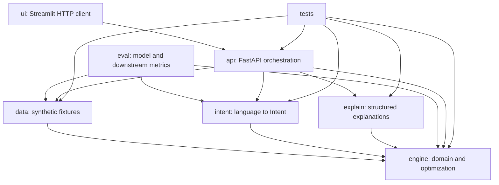

# Payment Optimization Engine - Canonical Implementation Plan

> **Audience:** two implementers working in parallel during a 1-2 day hackathon.
> **Authority:** this file owns scope, sequencing, cross-module contracts, and integration gates. Each module's `IMPLEMENTATION.md` owns the detailed design inside that boundary. If a module guide conflicts with this file, this file wins until the conflict is resolved here.

## A. How to use this repository

Read this section and [the shared integration contracts](docs/INTEGRATION_CONTRACTS.md) before writing code. Then read only the implementation guide for the module you own:

| Area | Guide | Owns |
|---|---|---|
| Deterministic engine | [engine/IMPLEMENTATION.md](engine/IMPLEMENTATION.md) | Domain models, scoring, feasibility, recommendation, greedy allocation, ILP, frontier, what-if |
| Synthetic scenarios | [data/IMPLEMENTATION.md](data/IMPLEMENTATION.md) | Fake card catalog, Sarah scenario, validated fixture loading |
| Intent parser and SFT data | [intent/IMPLEMENTATION.md](intent/IMPLEMENTATION.md) | Provider boundary, validation/fallback, reverse data generation, Freesolo integration |
| Explanation layer | [explain/IMPLEMENTATION.md](explain/IMPLEMENTATION.md) | Faithful structured decision cards and comparisons |
| HTTP API | [api/IMPLEMENTATION.md](api/IMPLEMENTATION.md) | FastAPI request/response contracts and application wiring |
| Streamlit demo | [ui/IMPLEMENTATION.md](ui/IMPLEMENTATION.md) | Operational browser workflow; no financial recomputation |
| Model evaluation | [eval/IMPLEMENTATION.md](eval/IMPLEMENTATION.md) | Frozen comparisons and downstream solver-verification metrics |
| Test strategy | [tests/IMPLEMENTATION.md](tests/IMPLEMENTATION.md) | Test layers, fixtures, brute-force oracle, integration gates |
| Reviewed decisions | [docs/LOGIC_REVIEW.md](docs/LOGIC_REVIEW.md) | Resolved ambiguities, assumptions, limitations, and rejected alternatives |
| Parallel workflow | [docs/PARALLEL_WORKFLOW.md](docs/PARALLEL_WORKFLOW.md) | Branch ownership, merge order, handoffs, and contract-change protocol |
| Failure behavior | [FAILURE_MODES.md](FAILURE_MODES.md) | Error semantics, fallback behavior, recovery, and demo resilience |

Do not create a second definition of a shared model in another module. Shared domain types live in `engine/models.py`; HTTP wrappers live in `api/schemas.py`; UI view models remain untyped dictionaries received from the API. Proposed contract changes must update `engine/models.py`, `docs/INTEGRATION_CONTRACTS.md`, the owning tests, and every affected module guide in the same change.

## B. Non-negotiable invariants

1. The optimization engine is deterministic. Machine learning parses language only.
2. Currency and currency-derived values use integer cents or millicents. Rates use integer basis points. No binary float may enter reward, utilization, bonus, cashflow, or solver arithmetic.
3. Intent weights arrive as finite JSON numbers. The parser/domain model validates and normalizes them for interchange; `engine/objective.py` then converts them exactly once to nonnegative integer parts-per-million summing to `1_000_000` before any score or solver arithmetic.
4. Raw measurements and optimization utility are different concepts. The engine preserves auditable raw values, maps them through documented integer calibration functions, then applies intent weights. Explanations show raw values, not invented monetary interpretations of utility points.
5. Credit limits, locked assignments, active utilization ceilings, and requested must-hit bonuses are hard constraints. Cashback, travel value, ordinary bonus preference, cashflow, credit-health preference, and risk preference are soft objectives.
6. A solver result is labeled `optimal` only when enumeration or CBC proves optimality. Greedy results are `heuristic`; timeout/error fallback results are `heuristic_fallback`; ILP-proven or analytically proven contradictions are `infeasible`; and a heuristic dead end without proof is `unresolved`.
7. Explanations are templates over solver output. No LLM writes, edits, or verifies financial reasoning.
8. All people, account states, transactions, bonus progress, and payment workflows are synthetic. Card product names and ordinary reward terms may be timestamped public reference data from official issuer pages. No credentials, card numbers, real PII, or real-money movement enters the system.
9. The UI never reimplements scoring. It renders structured API output and submits user edits back to the API.
10. The sampled strategy frontier is not claimed to be the complete mathematical Pareto frontier. It is a deterministic, coarse weight sweep followed by exact dominance filtering over the plans that were sampled.

## C. Dependency direction



These arrows are one-way. In particular, `engine` must not import `intent`, `explain`, `api`, `ui`, `eval`, or `data`; `intent` must not call an optimizer; and `explain` must not recompute scores.

## D. Parallel ownership

### Implementer A - deterministic product path

Own `engine/`, `data/`, `explain/`, `api/`, and `ui/` in this order:

1. Shared domain models and weight quantization.
2. Synthetic Sarah fixtures and loaders.
3. Scoring, feasibility, and objective composition.
4. Single-purchase recommendation.
5. Greedy monthly allocation and structured failures.
6. Explanation blocks.
7. FastAPI and Streamlit end-to-end loop.
8. Exact ILP, sampled strategy frontier, and one what-if.

### Implementer B - language and verification path

Begin after `Goal`, `Constraint`, `Intent`, and parse-result contracts pass their tests. Own `intent/` and `eval/`:

1. Provider protocol, JSON extraction, validation, normalization, and visible fallback.
2. Seeded latent-intent generation, leak-free split, JSONL assembly, caching, and hashing.
3. Eval model-runner protocol, frozen probe scenarios, and local metric tests.
4. Once external access exists: general-model paraphrase generation, Freesolo SFT, real endpoint adapters, frozen three-model evaluation, and report.

There is currently no Freesolo access or general-model API key. Code the provider-independent paths and fixtures now; mark external generation, training, and measured comparisons as blocked rather than fabricating them.

## E. Integration checkpoints

| Gate | Required result | Blocks |
|---|---|---|
| G0 - scaffold | `pyproject.toml` parses; all package directories and guides exist | All implementation |
| G1 - contract | Pydantic models validate; weight quantization sums exactly to one million; synthetic scenario loads | Both tracks diverging |
| G2 - scoring | Pure scoring/objective tests pass; no float in money outputs | Recommendation and allocation |
| G3 - Chexy core | Recommender, greedy allocator, honest unresolved/infeasible failures, and explanations pass deterministic tests | API/UI |
| G4 - browser loop | Sarah mortgage and travel stories run through API and Streamlit | Exact-solver work |
| G5 - exact depth | Tiny ILPs match brute-force; optimal result is no worse than greedy; frontier and what-if pass | Final Chexy submission |
| G6 - model local | Parser fallback, dataset pipeline, and metric harness pass with fixture providers | External training |
| G7 - model measured | Frozen trained/base/big-model runs complete with fallback disabled | Freesolo claims |
| G8 - release | Ruff, full pytest, API smoke, UI smoke, failure-mode review, and demo rehearsal pass | Submission |

Integrate at every gate. Do not let either branch accumulate more than one gate of unmerged contract changes.

## F. Reviewed technical corrections

The original concept is sound, but the following corrections are required for defensible behavior:

- **Comparable objectives:** raw cents, basis points, days, and risk are not directly comparable. `engine/objective.py` must convert each raw factor into documented integer utility points before applying intent weights.
- **Aggregate effects:** utilization and bonus completion depend on all purchases assigned to a card. The monthly greedy and ILP objectives must model aggregate card state; they cannot sum static single-purchase penalties and still claim correctness.
- **Heuristic honesty:** largest-first greedy is not guaranteed to find a plan whenever one exists. A bounded repair pass may recover common dead ends, but failure remains `unresolved` unless an analytical check or exact solver proves infeasibility.
- **Temporal utilization:** `max_utilization_bps` means a per-card hard ceiling. With `max_utilization_until`, only balances plus planned purchases dated on or before that cutoff count toward this particular ceiling. Full-horizon spend still counts toward the credit limit.
- **Conservative balance horizon:** the MVP assumes no card payments during the planned month. Statement dates control cashflow timing but do not reset `current_balance_cents`.
- **Bonus accounting:** projected rewards include a signup bonus only when the threshold is reached by its deadline. Partial progress may affect optimization utility but is never displayed as earned money.
- **Bonus timing:** deadline eligibility supplies the MVP's temporal behavior. There is no extra continuous "urgency" multiplier, because the available inputs do not justify calibrating one and it would complicate exact parity between Python and ILP objectives.
- **Fallback honesty:** equal weights with no constraints satisfy the original parser contract but are not financially "safe" in a production-advice sense. The synthetic demo must return `used_fallback=true`, show a warning, and allow manual correction.
- **Frontier honesty:** a weighted sweep can miss unsupported nondominated integer solutions. Call the output a sampled strategy frontier and state its grid.
- **Annual fee treatment:** annual fees are portfolio-level sunk costs for this monthly routing problem and are displayed metadata, not assignment objective terms.

## G. Definition of done

A judge can load the synthetic Sarah portfolio, enter a goal, inspect parsed weights and hard constraints, plan the month, inspect faithful winner/alternative reasoning, compare sampled nondominated strategies, and reoptimize one rent what-if. The engine uses integer financial arithmetic, every result identifies its solver status, infeasible inputs return structured diagnostics, and external-model outages cannot crash the money path. Model claims come only from a frozen evaluation with named providers and fallback disabled.

---

## Original Product Specification

The remainder of this file preserves the original feature and narrative specification while correcting stale technical claims that conflict with the reviewed contracts above.

> **Read the whole relevant section before writing code.** Follow the milestone order. Do not build features that are not listed. When in doubt, prefer correctness and a working end-to-end loop over breadth.
---
## 0. TL;DR for the implementing agent
Build two things that connect:
1. **A deterministic optimization engine** (NOT machine learning) that, given a user's credit cards + weighted financial goals, recommends the best card for a purchase and allocates a month of purchases across cards. This is the **Chexy** track deliverable.
2. **A small fine-tuned LLM** that parses natural-language goal descriptions into the weight vector + constraints the engine consumes. This is the **Freesolo** track deliverable. It is trained via **SFT on synthetically generated data**.
The engine is the source of truth for all money math. The LLM only handles language. **The engine also acts as a verifier for the LLM** (see §9, Eval harness). Explanations are **templated from the engine's output**, never generated by an LLM.
**Hard rules that must hold everywhere:**
- All money is stored and computed in **integer cents**. Never use floats for currency.
- All user, account, transaction, bonus-progress, and payment data is **synthetic**. Public card product terms may be sourced from official issuer pages. No real money moves, live credentials, card numbers, or real PII.
- One trained model only (the intent parser). Explanations are templated.
- **No reinforcement learning.** SFT only. (RL is a timeline risk; explicitly out of scope.)
---
## 1. Project framing (for the Devpost writeup and demo narrative)
**One-sentence pitch:** A personalized payment-strategy engine that decides not just *which* card to use but *why*, optimizing every payment — especially large recurring ones like rent — around each user's financial goals.
**Target user:** A financially-engaged consumer with 2–5 credit cards who wants to hit a sign-up bonus, protect their credit score before a big application (e.g. a mortgage), or maximize rewards/cash flow — without manually reasoning about statement dates, utilization, and bonus deadlines.
**Payment problem addressed:** People pick cards by a single crude heuristic ("highest cashback") and ignore utilization impact, statement/due-date float, and time-bound bonus deadlines. Rent (Chexy's core use case) is the largest predictable expense and the biggest lever, but also the easiest to mismanage.
**Relationship to Chexy's mission:** Chexy lets users pay rent (and recurring bills) by card. This project is the intelligence layer on top: it tells the user how to route rent + everyday spend across their cards to hit their actual goals. It demonstrates a full workflow using sourced public product rules plus synthetic accounts and purchases.
**Differentiation (lead with these; the single-card picker is commodity):**
- Multi-card **monthly allocation** under real constraints (limits, utilization targets, bonus thresholds, statement timing).
- **Cash-flow / float** optimization via statement-close and due-date timing.
- **Temporal constraints**: bonus deadlines and "keep utilization low until date X" are constraints over time, not a static score.
- **Sampled strategy frontier**: instead of one answer, surface sampled non-dominated plans (e.g. "max cashback but medium credit impact" vs "balanced" vs "best utilization") and make the tradeoff explicit. This is a defensible way to present a multi-objective problem; disclose the bounded weight grid and treat it as a signature feature.
---
## 2. Architecture
```
                 ┌─────────────────────────────────────────────┐
   NL goal  ───► │  INTENT PARSER (fine-tuned small LLM)        │
  "hit my Amex   │  natural language → { weights, constraints } │
   bonus but     └───────────────────┬─────────────────────────┘
   keep score                        │  structured intent (JSON)
   safe for a                        ▼
   March          ┌─────────────────────────────────────────────┐
   mortgage"      │  OPTIMIZATION ENGINE (deterministic solver)  │
                  │  - single-purchase recommender               │
   card data ───► │  - monthly allocation (greedy baseline →     │
   purchases ───► │    ILP upgrade), integer-cents money math    │
                  │  - sampled strategy frontier (weight sweep) │
                  └───────────────────┬─────────────────────────┘
                                      │  solution(s) + factor contributions
                                      ▼
                  ┌─────────────────────────────────────────────┐
                  │  EXPLANATION LAYER (templated, not an LLM)   │
                  │  solver trace → decision-score cards         │
                  └───────────────────┬─────────────────────────┘
                                      ▼
                                  UI / demo
```
**Why the engine is deterministic, not ML:** the "reward earned on purchase X with card Y" is a *calculation*, not a *prediction*. There is no need for training data, and a learned approximation of a solver is strictly less correct — a liability on a financial-correctness track. To get ML training labels you would need the correct answer per scenario, which requires a solver anyway → circular. So: solver for math, LLM for language only.
**The verifier thread (ties both tracks together):** feed the LLM's predicted weights into the solver; check whether the solver's top recommendation matches the one produced by the *gold* weights. This "downstream match" is the headline eval metric and lets the solver double as a checker of the model.
---
## 3. Tech stack
- **Language:** Python 3.11+.
- **Solver:** `PuLP` with CBC for the ILP. CBC is normally included in supported PuLP distributions, but startup must health-check it. Greedy + local-search remains the verified fallback, and the writeup/UI must state the optimality tradeoff.
- **API layer:** `FastAPI` + `uvicorn`.
- **Data validation:** `pydantic` v2 (also gives clean JSON schemas for the LLM output contract).
- **Frontend:** minimal is fine. Option A (fastest): a single-page `Streamlit` app. Option B: a small React/Vite front end if a team member owns it. Do not let the UI eat solver/model time.
- **LLM training:** Freesolo's post-training platform (they provide infinite training credits during the event). SFT only.
- **Model inference for data generation:** a strong general model (via API) is used *offline*, only to synthesize training data and to spot-check — never in the live money path.
- **Testing:** `pytest`.
Keep everything in one repo. Suggested layout:
```
/engine        # deterministic solver + money math + data models
/intent        # LLM: data generation, training config, inference wrapper
/explain       # templated explanation layer
/api           # FastAPI app wiring engine + intent + explain
/ui            # streamlit or react
/data          # sourced product catalog + synthetic scenarios/training data
/eval          # eval harness + reports
/tests
README.md
```
---
## 4. Data models (define these first, in `/engine/models.py`)
All monetary fields are **integer cents**. All rates are stored as integers in **basis points** (1% = 100 bps) to avoid float drift; convert only at display time.
```python
# pydantic v2 models
class RewardRule:
    category: str            # "rent", "groceries", "travel", "dining", "other", ...
    rate_bps: int            # reward rate in basis points (e.g. 3% -> 300)
    reward_type: str         # "cashback" | "points" | "miles"
class Card:
    id: str
    name: str                # e.g. "Aurora Bonus (synthetic)"
    credit_limit_cents: int
    current_balance_cents: int          # already-charged this cycle
    reward_rules: list[RewardRule]      # first matching category applies; else "other"/base
    base_rate_bps: int                  # fallback reward rate
    base_reward_type: str               # "cashback" | "points" | "miles"
    point_value_millicents: int         # value of 1 point/mile, in millicents (1 cent = 1000). static table.
    annual_fee_cents: int
    statement_day: int                  # day of month statement closes (1-28)
    due_day: int                        # day of month payment due (1-28)
    signup_bonus: SignupBonus | None
class SignupBonus:
    spend_required_cents: int           # spend needed within the window
    spend_so_far_cents: int
    reward_value_cents: int             # value of the bonus if hit
    deadline_date: date                 # must hit by this date
class Purchase:
    id: str
    amount_cents: int
    category: str
    date: date                          # when it will be charged
    is_recurring: bool                  # rent flag → highlight in UI
    locked_card_id: str | None          # user pinned this purchase to a card (constraint)
class Goal(str, Enum):
    MAX_CASHBACK = "max_cashback"
    MAX_TRAVEL   = "max_travel"
    CREDIT_HEALTH = "credit_health"     # keep utilization low
    HIT_SIGNUP_BONUS = "hit_signup_bonus"
    MAX_CASHFLOW = "max_cashflow"       # exploit statement/due float
    MIN_RISK = "min_risk"
class Constraint:
    # temporal / hard constraints parsed from NL or set in UI
    max_utilization_bps: int | None = None        # per-card ceiling, e.g. <= 30%
    max_utilization_until: date | None = None      # applies until this date (e.g. mortgage app)
    must_hit_bonus_card_ids: list[str] = Field(default_factory=list)
class Intent:
    # THE contract between the LLM and the engine
    weights: dict[Goal, float]          # finite/nonnegative; normalized at validation
    constraints: Constraint
```
**`Intent` is the single interface** between the model and the solver. The LLM's only job is to emit valid `Intent` JSON. Validate it with Pydantic; if invalid and runtime fallback is enabled, use equal weights/no constraints, set `used_fallback=true`, and surface a warning. This is an operational demo fallback, not personalized "safe" advice. Evaluation never uses fallback.
---
## 5. Scoring functions (in `/engine/scoring.py`)
Each is a **pure, deterministic** function returning integer cents (or an integer score) so contributions are auditable and explainable. These are the per-dimension factors the objective combines.
- `reward_value_cents(card, purchase) -> int`
  Match purchase category to a `RewardRule` (else base rate). If cashback: `amount_cents * rate_bps // 10000`. If points/miles: `points = amount_cents * rate_bps // 10000`, then `value = points * point_value_millicents // 1000`. Integer math throughout.
- `utilization_after(card, extra_cents) -> int` (returns bps)
  `(current_balance_cents + extra_cents) * 10000 // credit_limit_cents`. Guard divide-by-zero (limit 0 → treat as maxed / infeasible).
- `utilization_penalty(util_bps) -> int`
  Convex piecewise-linear penalty rising above 30% (3000 bps), with nondecreasing integer slopes shared by Python and the ILP. Encodes the credit-health goal as a soft cost.
- `signup_bonus_progress_value(card, purchase) -> int`
  Marginal value of qualifying spend toward an unmet bonus, capped at the remaining threshold. Only purchases on/before the deadline count. Partial progress receives a configured minority of bonus utility; the rest appears only on completion. There is no separate urgency multiplier.
- `cashflow_value(card, purchase) -> int`
  Days of interest-free float gained = days from `purchase.date` to that card's payment due date given its statement cycle. Convert days to a small cents-equivalent with a configurable annual carrying rate and integer arithmetic.
- `risk_penalty(card, extra_cents) -> int`
  Soft incremental headroom penalty for leaving too little available capacity. Hard limit/ceiling violations are removed by shared feasibility checks, never approximated by a large penalty.
> Keep typed raw factor and plan/card summary models. Additive purchase factors and aggregate utilization/risk/bonus factors remain separate so monthly explanations and ILP coefficients stay correct.
---
## 6. The optimization engine (in `/engine/optimize.py`)
### 6a. Single-purchase recommender (warm-up, ~2 hrs)
For one purchase, for each feasible card compute a weighted score:
```
score(card) =  w_cashback   * reward_value_cents
             + w_travel     * travel_reward_value_cents
             + w_signup     * signup_bonus_progress_value
             + w_cashflow   * cashflow_value
             - w_credit     * utilization_penalty
             - w_risk       * risk_penalty
```
Drop any card that violates a hard constraint (over limit, breaches active utilization ceiling, locked to a different purchase). Return the argmax **plus the full factor breakdown** for the winner and the runner-up (needed for "why not the other card" explanations). This is the warm-up, not the centerpiece.
### 6b. Monthly multi-card allocation (the centerpiece, ~½–1 day)
**This is where the technical depth lives. Prioritize it.**
Problem: assign each of N purchases in the month to one of M cards to maximize total weighted objective, subject to constraints.
**Build in two stages, in this order — do not skip the first:**
**Stage 1 - greedy baseline (build this first, ~1-2 hrs).** Place locked purchases first, then remaining purchases largest-first. Assign each to the best marginal card under the current aggregate plan state, run bounded relocation repair if a step dead-ends, then run deterministic relocation/swap improvement passes. This is the shippable heuristic path for the curated Sarah scenario, but it is not complete: a failed search is `unresolved` unless an analytical check proves infeasibility.
**Stage 2 - ILP upgrade (layer on top once Stage 1 works, ~half day).** Re-solve the same aggregate objective as an exact integer program. Claim optimality only when CBC returns an optimal status. On timeout/error, return the independently verified greedy result as `heuristic_fallback`; do not label a CBC incumbent optimal.
> Why both, and why this order: greedy establishes a testable end-to-end product path before exact-solver work. The ILP then adds a proof-producing result and makes sampled strategy sweeps practical. The default demo scenario is tested to succeed through both paths; arbitrary heuristic inputs may still be unresolved.
The **ILP formulation** (PuLP, CBC backend):
- **Decision variables:** `x[p][c] ∈ {0,1}` — purchase `p` assigned to card `c`.
- **Assignment constraint:** every purchase goes to exactly one card: `sum_c x[p][c] == 1` for all `p`. (Assume one card per purchase; do not split a single purchase across cards — keep it tractable and realistic.)
- **Locked purchases:** if `purchase.locked_card_id` set, force `x[p][that_card] == 1`.
- **Credit-limit constraint (hard):** for each card, `current_balance + sum_p (x[p][c] * amount_p) <= credit_limit`.
- **Utilization ceiling (hard, if active):** constrain current balance plus charges dated on/before `max_utilization_until`; without a cutoff, constrain the full planning horizon. Use exact cross multiplication, independent of statement timing.
- **Bonus threshold (soft or hard):** model deadline-eligible assigned spend, capped progress, and a binary threshold indicator with exact linking constraints. Add partial-progress and completion utility without counting either as earned money. Force the indicator for IDs in `must_hit_bonus_card_ids`.
- **Objective:** precompute only additive purchase/card reward and cashflow coefficients. Model aggregate utilization, risk headroom, capped bonus progress, and bonus completion with card-level variables using the same integer functions/configuration as the Python evaluator. **Weights come from the quantized `Intent`.**
Return: the assignment map, total projected reward, resulting per-card utilization, bonus progress, and a per-purchase factor breakdown.
**Explicitly document hard vs soft:** credit limits and active utilization ceilings and forced bonuses are **hard constraints**; reward/cashflow/general-utilization-preference are **objective terms**. Being able to state this cleanly is a scoring point.
### 6c. Sampled strategy frontier (signature feature, ~2-3 hrs on top of 6b)
Instead of collapsing everything into one weighted answer, surface the non-dominated allocations found by a coarse weight sweep so the user sees real sampled tradeoffs. A plan A *dominates* plan B over the swept goals if A is at least as good on every corresponding unweighted metric and strictly better on at least one. Weighted sweeps can miss unsupported nondominated integer allocations, so this is never presented as the complete mathematical frontier.
**How to generate it (cheap once 6b exists):**
1. Sweep a grid of weightings across the objectives the user said they care about (for a 2-objective case like cashback-vs-credit-health, step the weight from all-A to all-B in ~5–9 increments; for 3 objectives use a coarse simplex grid). Re-solve the allocation at each point. This is just calling 6b in a loop — trivial with the ILP, workable with the greedy baseline too.
2. For each resulting plan, record the unweighted metric corresponding to each swept goal (cashback cents, travel-value cents, credit penalty points, signup goal points, cashflow value cents, or risk penalty points) - **not** the blended score.
3. Discard dominated sampled plans; keep the sampled frontier. De-duplicate identical allocations.
4. Return 3–5 representative frontier points with human labels ("Max cashback", "Balanced", "Best credit health") derived from which objective each point favors.
**Presentation:** a small table or 2-axis scatter with sampled nondominated points, each expandable into its allocation and explanation. Always state how many weight settings were attempted and that other nondominated allocations may exist.
**Scope guard:** cap the grid resolution so the sweep stays fast (a few seconds). Do not attempt a full high-dimensional frontier across all six objectives at once — pick the 2–3 the user actually weighted and sweep those. This is a stretch feature: build it only after 6b and the explanation layer work end-to-end.
### 6d. What-if (cheap, high demo value)
`what_if(base_scenario, override) -> diff`: re-run 6a/6b with one purchase's card changed (e.g. "put rent on Card B instead") and return the delta in reward, utilization, and bonus progress. This is just two solver calls and a diff — include exactly one "what-if" in the demo, no more.
---
## 7. Financial correctness & failure modes (in `/engine/` + tests; REQUIRED by track rule #6)
The track explicitly asks for privacy/security/reliability/financial-correctness/error-handling/failure-mode reasoning. Most teams skip this — it's cheap points. Implement and be ready to talk about:
- **Integer cents everywhere.** Add a test that asserts no float appears in money paths. Rounding is explicit and documented (floor on reward accrual).
- **Divide-by-zero / zero-limit cards** → treated as infeasible, not a crash.
- **Purchase exceeds every card's limit** → return a clear "no feasible single-card assignment" result, suggest which constraint to relax; never throw to the UI.
- **Infeasible ILP** (constraints conflict, e.g. two hard bonuses that can't both be met within limits) → detect `LpStatusInfeasible`, return a structured explanation of which constraints collided + a suggested relaxation. Do not crash.
- **Conflicting goals** (e.g. max-cashback vs credit-health) → the weighted objective resolves them; the explanation must name the tension and which side won.
- **Uncertain point valuations** → use a **static** cents-per-point table (documented assumption). Do NOT model award availability or dynamic redemptions — explicit non-goal.
- **LLM output invalid** -> Pydantic validation fails -> when runtime fallback is enabled, return the visibly labeled equal-weight/no-constraint fallback. The money path never trusts raw or invalid model output; evaluation disables fallback.
- **Privacy/security:** all persona/account/transaction state is synthetic; public product terms are sourced and timestamped; no credentials, card numbers, or real PII are collected; state stays local/in-memory. Say this explicitly in the writeup.
Write a short `FAILURE_MODES.md` capturing the above — it doubles as demo talking points and satisfies rule #6.
---
## 8. Intent parser — the Freesolo model (in `/intent/`)
### 8a. The task
Input: a free-text goal description. Output: strict `Intent` JSON (weights over the 6 goals summing to 1.0, plus optional constraints). Single-turn is sufficient; multi-turn ("what-if" conversation) is a stretch goal only.
### 8b. Synthetic training data — generate in reverse (in `/intent/gen_data.py`)
Do **not** hand-label descriptions. Instead:
1. Sample a weight vector from a sensible distribution (Dirichlet over the 6 goals; sometimes sparse — one dominant goal; sometimes balanced).
2. With some probability, sample a constraint (e.g. `max_utilization 30% until <future date>`; a forced bonus on a card).
3. Prompt a strong model (offline, via API) to write **1–3 natural phrasings** a real user might say for that exact intent. Vary tone/length/specificity. Include some messy/colloquial ones.
4. Emit `(description, intent_json)` pairs.
Target ~800–2000 pairs (cheap to generate). Hold out ~15% as a test set. De-dupe near-identical descriptions. Include a handful of hand-written adversarial/ambiguous examples in the test set only.
**Data format:** JSONL, one `{"messages": [...] }` per line matching Freesolo's expected SFT schema (a system prompt defining the JSON contract, the user description, the assistant JSON answer). Check Freesolo's platform docs for the exact field names and adapt.
### 8c. Training (Freesolo platform)
- Method: **SFT** on a small/weak base model (an SLM). The thesis is explicitly "a small trained model beats relying on a big general model here" — so a small base is the point, not a compromise.
- Use the infinite training credits. Keep the run reproducible: log base model, hyperparameters, dataset hash.
- Output: a small model that reliably emits valid `Intent` JSON.
### 8d. Inference wrapper (in `/intent/parser.py`)
`parse_intent(text: str) -> Intent`: call the trained model, parse JSON, validate with pydantic, normalize weights to sum to 1.0, fall back to default `Intent` on any failure. **Keep a prompted-big-model path behind a flag** so the live demo never breaks if the trained endpoint hiccups — but the *submission* and eval use the trained SLM.
---
## 9. Eval harness (in `/eval/`) — this IS the Freesolo deliverable, not an afterthought
Produce a small report comparing, on the held-out set:
- **Trained SLM** (the submission)
- **Base SLM** (same model, no fine-tuning, prompted)
- **Big general model** (prompted) — as a ceiling reference
Metrics:
1. **Valid-JSON rate** — fraction of outputs that parse and validate.
2. **Weight error** — e.g. mean absolute error / KL between predicted and gold weight vectors.
3. **⭐ Downstream match rate (headline metric)** — feed predicted weights into the solver on a fixed scenario; check whether the solver's top recommendation equals the recommendation from the *gold* weights. This is the compelling number: it measures what actually matters (does the parse lead to the right decision?) and makes the **solver a verifier of the model**. Lead the Freesolo pitch with this.
4. **Constraint extraction accuracy** — did it catch the "utilization ceiling until date" / forced-bonus constraints?
The story to tell: *"Our small fine-tuned model matches (or approaches) the big model on downstream decision accuracy while being small and cheap — and the deterministic solver both does the money math and verifies the model's parses."* The ablation table is itself what the track wants to see.
---
## 10. Explanation layer (in `/explain/`) — templated, NOT an LLM
Explainability is one of the project's killer features — treat it as a first-class visual, not an afterthought paragraph. `explain(solution, factor_breakdowns, intent)` returns **structured blocks** (not just a string) so the UI can render a **decision-score card** per recommendation:
```
  ┌──────────────────────────────────────────┐
  │  Visa Infinite (synthetic)      Score 91  │
  │  ✅ +$42 projected rewards                 │
  │  ✅ Utilization stays at 18% (under 20%)   │
  │  ✅ Reaches Amex signup bonus              │
  │  ✅ 42 days of interest-free float         │
  │  ⚠️  Risk: Low                             │
  │  Why not Amex Gold? −$11 rewards, util 34% │
  └──────────────────────────────────────────┘
```
Every line is built from the solver's actual numbers:
- Which factor(s) dominated the winning card's score (from `factor_breakdown`).
- Why the runner-up lost (the specific factor gap — always show this; it's the most convincing part).
- Which hard constraints were binding (limit, utilization ceiling, forced bonus).
- Bonus progress delta and whether a deadline is at risk.
Templated explanations are **faithful by construction** and cannot hallucinate — exactly right for a fintech demo. Do not route money reasoning through a language model.
> Note: do **not** attach a "confidence" score to these factors. The engine is deterministic, so `reward = amount × rate` is exact — reporting confidence on an exact calculation would undercut the "calculations, not predictions" thesis. The only genuine uncertainty is point valuation, which is a documented static assumption, not a per-decision confidence.
---
## 11. API + UI
**API (`/api/main.py`, FastAPI):**
- `GET /demo-scenario` -> sourced product definitions combined with Sarah's synthetic accounts, purchases, reference date, and manual intent presets
- `POST /parse-intent` -> `{text, reference_date, card_context}` -> parse result with `Intent`, source, fallback state, and warnings
- `POST /recommend` → `{cards, purchase, intent}` → single-purchase rec + explanation
- `POST /allocate` → `{cards, purchases, intent}` → monthly allocation + metrics + explanation
- `POST /frontier` -> `{cards, purchases, intent}` -> sampled strategy frontier (3-5 labeled sampled non-dominated plans, metadata, metrics, explanations)
- `POST /what-if` → `{scenario, override}` → diff
**UI (Streamlit is fine):**
1. Load a pre-seeded portfolio of sourced Canadian products with synthetic limits, balances, and cycle dates; allow light account editing.
2. Free-text goal box -> shows the parsed `Intent` (weights as sliders the user can tweak, making the parse tangible and providing manual fallback). Surface supported **hard constraints** as separate visible chips ("Never exceed 20% per-card utilization", "Must hit Aurora bonus") rather than preference sliders.
3. "Recommend for this purchase" and "Plan my month" views.
4. Results rendered as **decision-score cards** (see §10): per-card score, the ✅/⚠️ factor lines, and the "why not the runner-up" line. Plus per-card utilization bars and bonus-progress bars.
5. **Strategies view:** a small scatter/table of sampled non-dominated plans, each expandable into its full allocation and decision cards, with grid-size/incompleteness disclosure.
6. One what-if control (e.g. a dropdown to move rent to another card) showing the live diff.
Highlight rent as a first-class, `is_recurring` purchase to anchor the Chexy narrative.
### The demo script (rehearse this ONE story — it matters more than any feature)
A single coherent narrative beats a feature tour. Use one persona and let the constraints visibly reshape the plan:
> **Sarah** has a synthetic account portfolio using RBC Avion Visa Infinite, American Express Gold Rewards, Scotia Momentum Visa Infinite, and Rogers Red World Elite. She types: *"I'm applying for a mortgage in 3 months so I need to keep my credit utilization low, but I'd still like to hit my synthetic Amex Gold spend bonus, and I pay $2,200 rent."*
>
> 1. The parser turns that into weights (credit-health high, signup moderate) **plus a hard constraint** (utilization ceiling until the mortgage date). Show the parsed intent + constraint chips.
> 2. Run **Plan my month** → show the allocation, decision cards, utilization staying under the ceiling, and Amex bonus progress.
> 3. Show the **sampled strategy frontier** -> "here are the other sampled viable strategies and what each trades away."
> 4. **Flip the goal:** *"Mortgage's done — now maximize travel rewards."* Re-run. The entire allocation visibly changes. Rent moves to a different card.
> 5. One **what-if:** "what if rent goes on the Visa instead?" → live diff.
That arc shows intent-parsing, constraint-aware optimization, multi-objective tradeoffs, and reactivity in ~2 minutes — without touching real money or real data.
---
## 12. Product reference and synthetic scenario data (in `/data/`)
- Eight agreed Canadian products with names, ordinary fees/earn rates, official issuer URLs, `verified_on` date, point-value basis, assumptions, and unmodeled terms.
- Sarah's synthetic portfolio account state: limits, balances, statement/due days, service qualification, and one synthetic one-stage bonus.
- Twenty synthetic August 2026 purchases including `$2,200` rent, groceries, dining, travel, recurring bills, and a large one-off.
- Five synthetic downstream probes designed so different goals can change the winning product.
- Do not claim that rent earns an issuer recurring-payment multiplier unless transaction classification is explicitly verified; the demo uses base earn for rent.
---
## 13. Build order (milestones with acceptance criteria)
Do these in order. Each milestone should leave the repo in a working state.
| # | Milestone | Acceptance criteria | Rough effort |
|---|-----------|---------------------|--------------|
| M1 | Data models + synthetic catalog | pydantic models validate; a demo portfolio + month of purchases load | ~1.5 hr |
| M2 | Scoring functions + tests | each factor pure, integer-cents, unit-tested incl. edge cases | ~2 hr |
| M3 | Single-purchase recommender | returns argmax + factor breakdown for winner & runner-up | ~2 hr |
| M4 | **Monthly allocation** | Stage 1 greedy+repair+local-search succeeds on the curated demo and distinguishes unresolved from proven infeasible; Stage 2 ILP matches brute force on tiny cases | **~half-1 day** |
| M5 | Failure modes + FAILURE_MODES.md | infeasible/over-limit/zero-limit/invalid-intent all handled, tested | ~2 hr |
| M6 | Explanation layer (decision-score cards) | structured blocks from real solver numbers; includes "why not the runner-up"; names binding constraints | ~2.5 hr |
| M7 | **Sampled strategy frontier** (stretch) | bounded weight sweep -> 3-5 sampled non-dominated labeled plans with incompleteness metadata | ~2-3 hr |
| M8 | Synthetic training-data generator | ~800–2000 `(description, intent)` pairs, JSONL, held-out split | ~3 hr |
| M9 | SFT on Freesolo | trained SLM emits valid Intent JSON | run hands-off; ~2 hr prep |
| M10 | Intent inference wrapper + fallback | validates output, normalizes weights, big-model fallback flag | ~1.5 hr |
| M11 | **Eval harness + report** | trained vs base vs big; downstream-match metric computed | ~3 hr |
| M12 | API + UI | end-to-end loop in the browser: decision cards, sampled strategies view, one what-if | ~half day |
| M13 | Demo polish + Devpost writeup | rehearse the Sarah script; pitch, architecture summary, rule-6 considerations, repo link | ~2.5 hr |
**Parallelization (2+ people):** one person owns M1–M7 + M12 (engine, Pareto, demo), another owns M8–M11 (data + model + eval). They meet at the `Intent` contract (§4) — agree on that JSON shape in the first hour and both sides move independently. **Whether to pursue Freesolo at all is mostly a team-size call:** with 2+ people the model track parallelizes cleanly and both prizes are in reach; solo, protect the Chexy build first and treat Freesolo as the stretch.
**Solo / tight-on-time cut order:** M1→M2→M3→M4(Stage 1 only)→M6→M12 gives a complete Chexy demo. Then add M4 Stage 2 (ILP) and M7 (Pareto) if time allows — these are the depth-and-signature upgrades. Then M8→M10→M11 for the Freesolo submission (M9 training runs in the background). M5 talking points and M13 writeup last. Priority order when cutting: keep the monthly allocation and explanation cards above all; drop what-if first, then Pareto, then Freesolo — never the allocation.
---
## 14. Explicit non-goals / scope guards (do NOT build these)
- ❌ **No ML for the optimization engine.** It is a deterministic solver. (This is the single most important instruction.)
- ❌ **No reinforcement learning.** SFT only.
- ❌ **No second trained model.** Explanations are templated.
- ❌ No dynamic travel-award-availability modeling. Static cents-per-point table only.
- ❌ No real money, credentials, card numbers, PII, account state, or transactions. Public issuer product terms are the only non-synthetic reference data.
- ❌ No splitting a single purchase across multiple cards.
- ❌ Do not implement all ~10 originally-brainstormed features. Core loop only: input cards -> NL goal -> parsed weights + constraints -> allocation -> decision-score cards -> sampled strategy frontier -> one what-if.
- ❌ Do not compute or claim a complete high-dimensional Pareto frontier. Sweep only the top 2-3 positively weighted objectives at coarse, bounded resolution.
- ❌ Do not attach "confidence" scores to deterministic factor calculations (see §10) — it contradicts the "calculations, not predictions" thesis.
- ❌ Do not let the UI consume time budgeted for the solver or the eval.
---
## 15. Definition of done
- A judge can, in the browser: load a portfolio, type a goal in plain English, see it parsed into weights + constraint chips, get a monthly card-by-card plan with projected rewards/utilization/bonus progress, read faithful decision-score cards, view a disclosed sampled strategy frontier, and run one what-if following the Sarah script end-to-end.
- The money math is integer-cents and the engine is deterministic; failure modes are handled, not crashed.
- The Freesolo submission includes a trained SLM and a frozen eval report comparing downstream match against the matching base model and a prompted large model. Performance claims reflect measured results, even if the trained model does not win.
- Devpost writeup covers: target user, payment problem, Chexy relationship, user benefit, tech/architecture summary, and the rule-6 considerations (privacy, security, reliability, financial correctness, error handling, failure modes). Repo linked.
---
*End of spec. Implement top-to-bottom. Correctness and a working end-to-end loop beat breadth.*