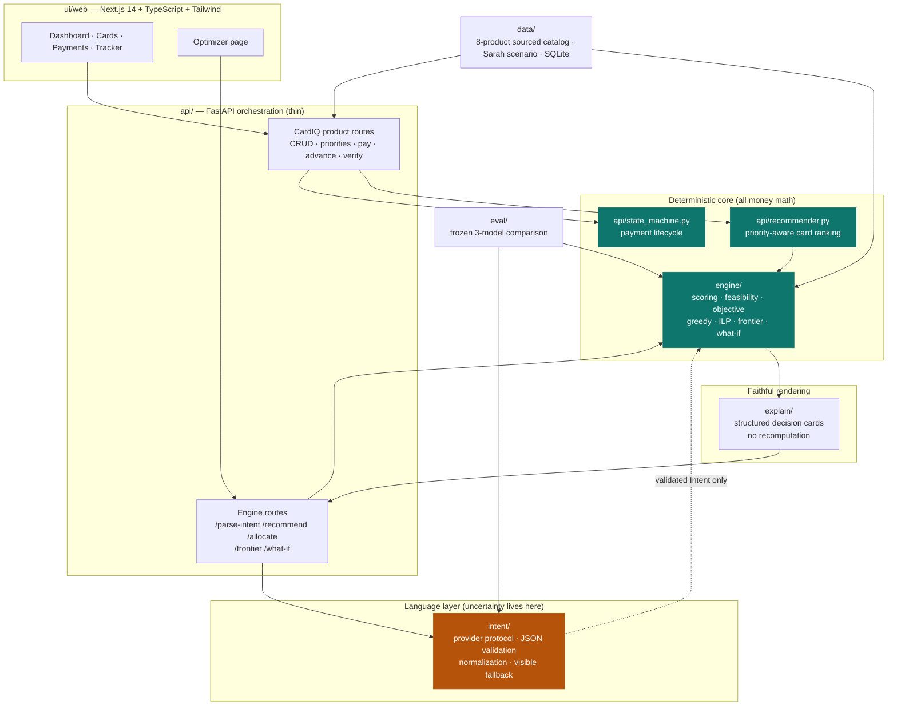
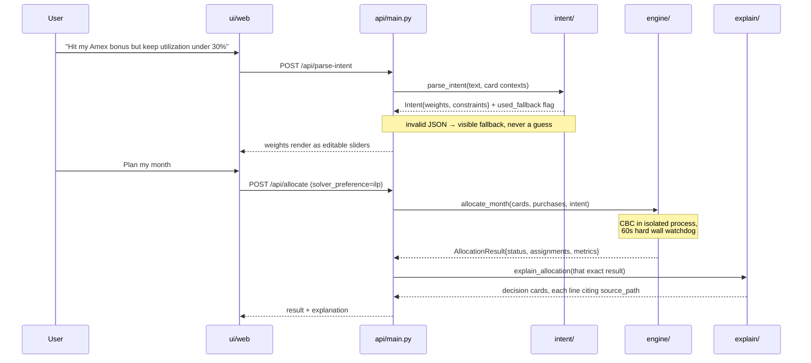
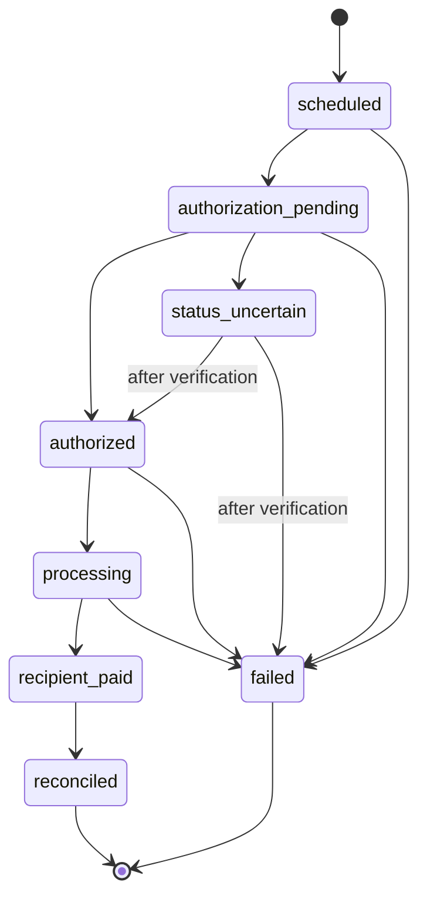

# CardIQ — Payment Optimization Engine

**Hack the 6ix · Chexy track**

CardIQ decides *which card should fund each recurring bill* — rent, tuition, utilities,
insurance, taxes — and re-decides safely whenever rewards, welcome bonuses, balances,
limits, deadlines, or card availability change.

The core thesis: **a language model should never do arithmetic that moves money.** CardIQ
splits the problem into a language layer that only produces a validated preference struct,
and a deterministic solver that owns every cent of the actual math. Everything financial is
integer-cent arithmetic with an exact ILP available and a brute-force oracle proving it right.

All data is synthetic. No real accounts, credentials, PII, or money movement exist anywhere
in this repo.

---

## Table of contents

- [The 60-second version for judges](#the-60-second-version-for-judges)
- [Architecture](#architecture)
- [Quickstart](#quickstart)
- [Demo walkthrough](#demo-walkthrough)
- [Module by module](#module-by-module)
- [Design decisions that matter](#design-decisions-that-matter)
- [Verification](#verification)
- [Honest status and limitations](#honest-status-and-limitations)

---

## The 60-second version for judges

| | |
|---|---|
| **Problem** | Recurring bills are put on one card and forgotten. The optimal funding card changes monthly with bonus deadlines, utilization, and limits. |
| **What it does** | Re-evaluates the best funding card before every major payment, explains the choice from real numbers, and executes through an explicit payment state machine that survives declines, timeouts, and double-clicks. |
| **Why it's trustworthy** | No LLM performs arithmetic or makes the final decision. The exact solver is verified against brute-force enumeration. Every explanation line cites the engine field it came from. |
| **Scale** | ~11,500 lines of Python across 8 modules + a Next.js app. **236 tests, all passing.** |
| **The interesting bit** | An exact all-binary ILP that models piecewise utilization penalties and all-or-nothing signup bonuses *without* big-M indicators — so Python and CBC provably agree on the objective. |

---

## Architecture

The dependency graph is enforced, not aspirational — `tests/unit/intent/test_dependency_boundary.py`
and the explain-layer equivalent walk the **AST** and fail the build if the language layer
imports a scoring function or the explanation layer imports a solver.



The single most important edge is the dotted one: **`intent` hands the engine a validated
`Intent` struct and nothing else.** If the model is unavailable, returns malformed JSON, or
hallucinates a key, the parser emits a visibly-labeled equal-weight fallback and the money
path proceeds unchanged.

### Request flow — the Optimizer arc



---

## Quickstart

**Backend** (FastAPI + SQLite, Python 3.11+):

```bash
python -m venv .venv
.venv/Scripts/python.exe -m pip install -e ".[dev]"      # Windows
.venv/Scripts/python.exe -m uvicorn api.main:app --port 8000
```

```bash
python3 -m venv .venv                                     # macOS / Linux
.venv/bin/pip install -e ".[dev]"
.venv/bin/uvicorn api.main:app --port 8000
```

**Frontend** (Next.js):

```bash
cd ui/web
npm install
npm run dev        # http://localhost:3000
```

With `uv`: `uv sync --extra dev`, then `uv run python -m pytest tests/unit -q`. Use
`uv run python -m pytest` rather than the generated `pytest.exe` launcher, which some
environments deny.

No API keys are required. The intent layer defaults to a fixture provider and shows a
visible fallback banner; live models are strictly opt-in (see [`intent/`](#intent--language-to-intent-boundary)).

---

## Demo walkthrough

### Arc 1 — CardIQ dashboard (the product)

Hit **Reset demo** on the dashboard. It loads Sarah's scenario from committed fixtures:
four catalog-backed cards (RBC Avion Visa Infinite, Amex Gold Rewards, Scotia Momentum Visa
Infinite, Rogers Red World Elite — real public product terms, synthetic account state) and
six recurring bills.

What to watch:

1. **Rent switches to the Amex Gold** — that single payment completes its $500 welcome
   bonus. Remaining bills route to whichever card wins on ordinary rate *once the bonus is
   already claimed*, not on the phantom assumption that every bill earns it.
2. **Drag bills to reorder them.** Priority is real: higher-priority bills reserve credit
   headroom and bonus progress before lower ones are scored.
3. **The "off optimal" figure** measures only the genuine cost of the priority ordering — a
   scarce card's limit consumed by an earlier bill. Its reference optimum shares the one-time
   bonus rather than crediting it to every bill, so a plan that routes each bill to its best
   remaining card reads **$0 off**, not a phantom loss.
4. **Pay a bill, then trigger a failure scenario.** Declines, insufficient credit, locked and
   expired cards, network timeouts, duplicate requests, and unknown authorization all have
   scripted paths through the state machine.
5. **Double-click Pay.** The idempotency key returns the original transaction instead of
   charging twice.

### Arc 2 — Optimizer page (the engine)

1. Type a goal in natural language → `POST /api/parse-intent` fills the weight sliders, with
   a banner if the fallback was used.
2. **Plan my month** → `POST /api/allocate` runs the exact ILP and renders decision cards with
   per-card utilization and bonus bars.
3. **Sampled strategies** → `POST /api/frontier` sweeps your top two or three goals and shows
   the tradeoff, explicitly labeled `complete_frontier=false`.
4. **What-if** → `POST /api/what-if` forces one purchase onto a different card and
   **reoptimizes everything else**, then shows integer deltas.

---

## Module by module

### `engine/` — deterministic optimizer (~3,800 LoC, 113 tests + 7 oracle tests)

The source of truth for every financial calculation. It parses no language, formats no UI
strings, calls no external service, loads no fixtures, and stores no state between requests.
It may import Pydantic and PuLP and nothing else in this project.

| File | Responsibility |
|---|---|
| `models.py` | Domain inputs, factors, metrics, issues, typed results. Pydantic v2 with `extra="forbid"` and `StrictInt` on every money/rate/day field — floats and numeric strings are rejected outright |
| `config.py` | Frozen calibration: utilization bands, carry rate, headroom targets, solver limits, reproducible config hashing |
| `dates.py` | Statement-close, due-date, and float-day math with month/year rollover |
| `scoring.py` | Pure per-purchase/card raw calculations: reward accrual, utilization, headroom, cashflow, bonus progress |
| `objective.py` | Decimal→ppm largest-remainder weight quantization and the single `evaluate_plan` used by every solver |
| `feasibility.py` | Shared constraints, exact cents capacity, stable issue codes, analytical infeasibility proofs |
| `recommend.py` | Exact single-purchase enumeration with stable winner/runner-up ranking |
| `greedy.py` | Stateful monthly heuristic with bounded repair, relocation, and swap local search |
| `ilp.py` | Exact PuLP/CBC allocation, objective parity verification, deterministic tie-breaking, honest fallback |
| `pareto.py` | Bounded sampled strategy frontier with raw-goal dominance filtering |
| `what_if.py` | Override one purchase, reoptimize, compute integer deltas |
| `optimize.py` | The only public call surface — 32 lines of dispatch |

**Six goals** are optimized jointly: `max_cashback`, `max_travel`, `credit_health`,
`hit_signup_bonus`, `max_cashflow`, `min_risk`.

Three things here are worth a judge's attention:

**1. Integer-only arithmetic.** Weights are quantized from `Decimal` to parts-per-million via
largest-remainder, so they sum to exactly 1,000,000. Cashflow carrying value multiplies before
dividing (`amount * rate_bps * days // (10000 * 365)`) so small values aren't erased. No float
touches a money path.

**2. The all-binary ILP formulation.** Piecewise utilization penalties and all-or-nothing
signup bonuses are nonlinear. Rather than big-M indicators, the engine enumerates the *finite
set of reachable assigned-spend states* per card from the indivisible purchase amounts, creates
one binary per state, and precomputes the exact penalty with **the same pure Python function
`evaluate_plan` uses**. This is why CBC and Python provably agree. Exceeding
`ilp_max_card_states` is an explicit `heuristic_fallback`, never a silent approximation.

**3. Honest solver status.** `optimal` (proven), `heuristic` (complete greedy plan),
`heuristic_fallback` (exact solver timed out, greedy verified), `infeasible` (*proven*
impossible), `unresolved` (greedy dead-ended without proof). The last distinction matters:
greedy failing is not evidence of infeasibility, and the engine will not claim it is.

CBC runs in a spawned worker process behind a caller-side watchdog capped at 60 seconds. If
CBC ignores its own timer, hangs, or dies natively, the parent kills the whole process tree and
returns the verified greedy fallback. The demo cannot hang.

### `data/` — sourced catalog and synthetic scenarios (11 tests)

Two deliberately separate layers:

- **Public product reference** — 8 Canadian cards (RBC ION+, RBC Avion Visa Infinite, TD Rewards
  Visa, TD Aeroplan Visa Infinite, Amex Cobalt, Amex Gold Rewards, Scotia Momentum Visa Infinite,
  Rogers Red World Elite) paraphrased from official issuer pages, each with source URLs, a
  verification date (`2026-07-18`), static point-value basis, and a record of every simplification
  the engine makes. See [`data/SOURCES.md`](data/SOURCES.md).
- **Synthetic account state** — Sarah's August 2026 scenario: 4 of those products with synthetic
  limits, balances, cycle dates, one explicitly synthetic signup bonus, and 20 purchases. Plus
  5 eval probes with intent-sensitive winners.

Product facts and account state never mix. `data` depends on `engine.models` for validation;
the engine never imports `data`. Also holds CardIQ's runtime SQLite (`data/cardiq.db`, gitignored).

### `intent/` — language-to-intent boundary (36 tests)

The only module allowed to be uncertain. It converts a natural-language goal into the engine's
`Intent` contract and generates supervised fine-tuning data — and it is **AST-enforced** to
import no scoring, solver, optimizer, explanation, or money-calculation module.

| File | Responsibility |
|---|---|
| `models.py` | Provider metadata with a strict allowlist, parse results, latent examples |
| `prompts.py` | Versioned JSON-only system prompt with reference date and minimal card context |
| `providers.py` | `IntentProvider` protocol, fixture providers, `GeminiIntentProvider` (Gemini REST), `FreesoloIntentProvider` (trained SLM over an OpenAI-compatible surface) |
| `parser.py` | Strict one-object/fenced-JSON extraction, non-standard-number rejection, known-key validation, missing-goal repair, normalization, absolute date validation, visible fallback |
| `sampling.py` | Seeded balanced/sparse/two-goal/constraint-heavy latent intent generation with exact ppm vectors |
| `gen_data.py` | **Reverse SFT generation** — sample structured intents first, then ask a general model to paraphrase them into user-sounding goals |
| `manifests.py` | SHA-256 train/test/combined hashes and reproducibility manifests |

The model emits only this, and only this is accepted downstream:

```json
{
  "weights": { "max_cashback": 0.1, "max_travel": 0.1, "credit_health": 0.45,
               "hit_signup_bonus": 0.25, "max_cashflow": 0.05, "min_risk": 0.05 },
  "constraints": { "max_utilization_bps": 3000, "max_utilization_until": "2026-10-18",
                   "must_hit_bonus_card_ids": ["aurora-bonus"] }
}
```

Note the parser does **not** emit ppm — `engine.objective` quantizes. That keeps one JSON
contract legible to both the SFT target and the UI sliders.

Card context passed to the model is derived safely: ID, name, and active-bonus state only.
Provider adapters log model identity and error class, never authorization headers.

Live providers are opt-in via `CARDIQ_INTENT_PROVIDER=freesolo|gemini` (default `fixture`), and
each self-reports unavailable until its own API env vars are set. On any provider error the
deterministic path still validates every field and falls back visibly.

### `explain/` — faithful rendering (~1,750 LoC, 29 tests)

Turns engine facts into structured decision cards. **AST-enforced** to import no scoring,
objective, feasibility, recommendation, greedy, ILP, frontier, what-if, or optimizer module —
it cannot recompute anything even by accident.

Every rendered line carries a `source_path` pointing at the engine field it came from, plus
`kind`, `tone`, `raw_value`, `unit`, and the `goal` it serves. The layer detects contract
mismatches (missing IDs, an "improving" alternative inside a plan claimed optimal, inconsistent
traces) and raises rather than rendering a lie.

It is specifically forbidden from: calling an LLM, inventing confidence values, describing
partial bonus progress as earned reward, or describing a heuristic or sampled frontier as
mathematically complete.

`builder.py` handles recommendations and allocations; `frontier.py` handles sampled strategies
and what-if; `formatters.py` does integer-only currency/bps/day formatting.

### `api/` — FastAPI orchestration (28 unit + 12 integration tests)

A thin layer: validate shape, select solver/provider, call the engine, ask `explain` to
structure it, return versioned JSON. It duplicates no financial calculation.

**Engine routes** (versioned `ApiResponse` envelope, `schema_version: "1.0"`):
`GET /api/health` · `GET /api/catalog` · `GET /api/demo-scenario` · `POST /api/parse-intent` ·
`POST /api/recommend` · `POST /api/allocate` (greedy **or** ILP) · `POST /api/frontier` ·
`POST /api/what-if`. The four solver routes attach the `explain/` structure to the result.

**CardIQ product routes** (plain JSON, consumed by `ui/web`): card and payment CRUD,
`PUT /api/payment-priorities`, `GET /api/payments/{id}/recommendation`, `approve-switch`,
`pay`, `transactions/{id}/advance`, `transactions/{id}/verify`, `/api/dashboard`, `/api/events`.

Two files carry the product logic:

- **`recommender.py`** — card ranking, priority planning, and templated explanations over
  `engine.scoring`. `build_projected_states` gives the dashboard, per-payment recommendation,
  switch, and failover surfaces **one shared priority-projected card state**, so a one-time
  welcome bonus claimed by a higher-priority bill is never re-offered to a lower one.
- **`state_machine.py`** — the payment lifecycle:



Transitions are validated against `ALLOWED_TRANSITIONS` — the failure simulator can only
produce sequences the machine permits. **`status_uncertain` is never auto-retried**; it parks
until the original transaction is verified. A confirmed decline reruns card selection and
recommends the backup card *without* duplicating the payment.

**Error policy:** domain infeasibility is HTTP 200 with a typed result — it is a valid answer,
not a server error. 422 for malformed requests, 503 for a required-but-unavailable provider,
502 for malformed model output with fallback disabled. Exception representations that might
contain requests, environment data, or provider payloads are never exposed.

### `ui/web/` — Next.js 14 + TypeScript + Tailwind (~2,500 LoC)

Renders structured API output and **never recomputes a financial metric**. All money crosses
the wire as integer cents; `money()`/`pct()` in `src/lib/api.ts` format for display only.

| Route | Purpose |
|---|---|
| `app/page.tsx` | Dashboard — priority-ordered bills, drag to reorder, switch recommendations, alerts, off-optimal accounting |
| `app/cards/page.tsx` | Card portfolio + catalog browser |
| `app/payments/page.tsx` | Bill management |
| `app/payments/[id]/page.tsx` | Per-payment recommendation, ranked evaluations, pay + failure simulation |
| `app/optimize/page.tsx` | The engine arc: goal box → sliders → plan → sampled strategies → what-if |
| `lib/api.ts` | Fully typed client for both the CardIQ and engine surfaces |

The original plan called for Streamlit; the shipped UI is the Next.js app. `ui/IMPLEMENTATION.md`
retains the superseded design notes for reference.

### `eval/` — frozen model comparison (~1,500 LoC, credential-gated)

Measures whether a model reliably converts language into the `Intent` contract and — the part
that actually matters — **whether parser error changes the deterministic payment decision.**

It compares exactly three named systems on one frozen held-out set: the fine-tuned small model,
the same base model prompted without fine-tuning, and a strong general model as a ceiling
reference. Run with `python -m eval [--resamples N] [--seed N] [--refresh]`.

The harness is structurally incapable of flattering itself: fallback is disabled (it parses raw
model text directly), it never edits outputs to match gold decisions, and it never excludes
invalid outputs from end-to-end success rates. Roles without configured credentials are honestly
omitted, which forces the report to be labeled **partial**.

`metrics.py` computes bootstrap confidence intervals; `report.py` renders JSON and Markdown.

### `tests/` — 236 tests, all passing

| Suite | Count | What it proves |
|---|---:|---|
| `tests/unit/engine` | 113 | Scoring, dates, objective, feasibility, greedy, ILP, frontier, what-if |
| `tests/unit/intent` | 36 | Parsing, providers, sampling, generation, **AST dependency boundary** |
| `tests/unit/explain` | 29 | Faithful rendering, contract-mismatch detection |
| `tests/unit/api` | 28 | Recommender, state machine, engine contract endpoints |
| `tests/unit/data` | 11 | Catalog validity, scenario cross-references, loaders |
| `tests/oracle` | 7 | **ILP vs. brute-force enumeration** |
| `tests/integration` | 12 | CardIQ demo end-to-end, engine API end-to-end in-process |

The oracle suite is the one to look at. `test_ilp_bruteforce.py` enumerates every possible
assignment on small fixtures and asserts the ILP matches — covering aggregate utilization,
headroom, bonus progress and completion, locks, temporal ceilings, and indivisible infeasibility.
Other engine tests assert repeat runs deep-equal, local search never reduces utility, and exact
optimal utility is always ≥ greedy on the same feasible scenario.

---

## Design decisions that matter

**The LLM never touches arithmetic.** It emits a preference struct. That struct is validated
field by field, normalized, and quantized by deterministic code. A hallucinated weight is
still just a weight — it cannot produce a wrong dollar figure, only a differently-prioritized
plan that is itself computed correctly.

**Fallbacks are visible, never silent.** Every degraded path is labeled in the response and
surfaced in the UI: `used_fallback`, `heuristic_fallback`, `complete_frontier=false`,
`priority_status`. A judge can always tell what the system actually did.

**`infeasible` requires proof.** Analytical proofs include unknown locks, a locked purchase
exceeding its card's capacity, a purchase fitting no card, total spend exceeding total credit,
and forced-bonus spend exceeding eligible capacity. Absent a proof, greedy failure reports
`unresolved` — a different and more honest claim.

**Determinism is testable.** No request timestamps or random response IDs in payloads, so
repeated engine requests canonicalize to deeply equal JSON. Ties break lexicographically by
card ID. Solve durations go to debug logs, not responses.

**Safety by construction.** Cards are stored as fake `synthetic_tok_*` tokens — no real card
number format exists anywhere. Every card switch requires explicit user approval. Every payment
action is written to an audit log. Goal text, card objects, raw model output, and environment
values are never logged by default.

---

## Verification

```bash
.venv/Scripts/python.exe -m pytest tests/unit tests/oracle tests/integration -q
.venv/Scripts/python.exe -m ruff check api engine data explain intent eval tests
```

Last full run: **236 passed** in ~52s.

Focused module gates:

```bash
uv run python -m pytest tests/unit/engine tests/oracle -q     # engine + exactness oracle
uv run python -m pytest tests/unit/intent -q                  # includes AST boundary check
```

---

## Honest status and limitations

**Fully implemented and tested:** the deterministic engine (all solvers), the sourced catalog
and Sarah scenario, the explanation layer, the intent provider boundary with validation and
fallback, the FastAPI backend (both surfaces), and the Next.js UI including the Optimizer page.

**Implemented but not measured:** `eval/` is complete in code but has no unit tests and cannot
produce a real report without model credentials. The SFT dataset under
`intent/training/freesolo/` currently holds **240 train / 120 eval fixture rows** — the module's
own rule is that production claims require 800–2,000 accepted records, so **these are fixture
datasets and we make no trained-model performance claim.**

**Blocked on external access:** the measured Freesolo SFT run, general-model paraphrase
generation at real scale, and the frozen trained-vs-base-vs-big comparison. These are gated on
credentials, not on unwritten code.

**Deliberately out of scope:** real payment rails, statement ledgers, interest charges, award
availability, and credit-score modeling. The engine documents every simplification it makes
against the sourced product terms.

**Two known documentation drifts:** `.env.example` lists `INTENT_PROVIDER`, but the code reads
`CARDIQ_INTENT_PROVIDER`. CardIQ's own recommendation explanations remain templated inside
`api/recommender.py`, separate from the engine's `explain/` layer — two explanation paths, by
history rather than design.

---

## Repository guide

| Document | Purpose |
|---|---|
| [`PLAN.md`](PLAN.md) | Full scope, ownership, sequencing, and integration gates |
| [`docs/INTEGRATION_CONTRACTS.md`](docs/INTEGRATION_CONTRACTS.md) | Shared type contracts — read before changing them |
| [`docs/LOGIC_REVIEW.md`](docs/LOGIC_REVIEW.md) | Resolved design decisions and their rationale |
| [`FAILURE_MODES.md`](FAILURE_MODES.md) | Domain, solver, provider, and demo recovery behavior |
| [`data/SOURCES.md`](data/SOURCES.md) | Product provenance and verification dates |
| `<module>/IMPLEMENTATION.md` | Per-module design reference (8 modules) |
