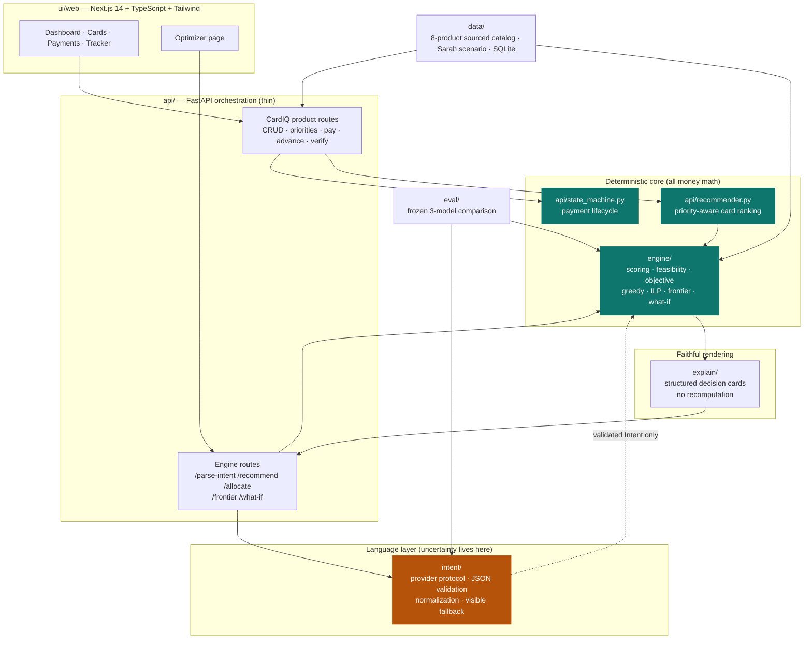

# CardIQ — Payment Optimization Engine

CardIQ decides *which card should fund each recurring bill* — rent, tuition, utilities,
insurance, taxes — and re-decides safely whenever rewards, welcome bonuses, balances, limits,
deadlines, or card availability change.

The core thesis: **a language model should never do arithmetic that moves money.** CardIQ splits
the problem into a language layer that only produces a validated preference struct, and a
deterministic solver that owns every cent of the actual math. Everything financial is
integer-cent arithmetic, with an exact ILP available and a brute-force oracle proving it right.

All data is synthetic. No real accounts, credentials, PII, or money movement exist anywhere in
this repo.

---

## The 60-second version

| | |
|---|---|
| **Problem** | Recurring bills get put on one card and forgotten. The optimal funding card changes monthly with bonus deadlines, utilization, and limits. |
| **What it does** | Re-evaluates the best funding card before every major payment, explains the choice from real numbers, and executes through an explicit payment state machine that survives declines, timeouts, and double-clicks. |
| **Why it's trustworthy** | No LLM performs arithmetic or makes the final decision. The exact solver is verified against brute-force enumeration. Every explanation line cites the engine field it came from. |
| **Scale** | ~11,500 lines of Python across 8 modules + a Next.js app. **236 tests, all passing.** |
| **The interesting bit** | An exact all-binary ILP that models piecewise utilization penalties and all-or-nothing signup bonuses *without* big-M indicators — so Python and CBC provably agree on the objective. |

---

## Architecture

The dependency graph is enforced, not aspirational — an AST-walking test fails the build if the
language layer imports a scoring function, or the explanation layer imports a solver.



The single most important edge is the dotted one: **`intent` hands the engine a validated
`Intent` struct and nothing else.** If the model is unavailable, returns malformed JSON, or
hallucinates a key, the parser emits a visibly-labeled equal-weight fallback and the money path
proceeds unchanged.

---

## Quickstart

**Backend** (FastAPI + SQLite, Python 3.11+):

```bash
python -m venv .venv
.venv/Scripts/python.exe -m pip install -e ".[dev]"      # Windows
.venv/Scripts/python.exe -m uvicorn api.main:app --port 8000
```

```bash
python3 -m venv .venv                                     # macOS / Linux
.venv/bin/pip install -e ".[dev]"
.venv/bin/uvicorn api.main:app --port 8000
```

**Frontend** (Next.js):

```bash
cd ui/web
npm install
npm run dev        # http://localhost:3000
```

With `uv`: `uv sync --extra dev`, then `uv run python -m pytest tests/unit -q`.

No API keys are required to run the demo. The intent layer defaults to a fixture provider and
shows a visible fallback banner; live model providers are strictly opt-in (see
[`intent/IMPLEMENTATION.md`](intent/IMPLEMENTATION.md)).

---

## Demo walkthrough

**Arc 1 — CardIQ dashboard.** Hit **Reset demo**. It loads Sarah's scenario: four catalog-backed
cards (RBC Avion Visa Infinite, Amex Gold Rewards, Scotia Momentum Visa Infinite, Rogers Red World
Elite — real public product terms, synthetic account state) and six recurring bills.

1. **Rent switches to the Amex Gold** — that single payment completes its $500 welcome bonus. Remaining bills route to whichever card wins on ordinary rate *once the bonus is already claimed*, not on the phantom assumption that every bill earns it.
2. **Drag bills to reorder them.** Priority is real: higher-priority bills reserve credit headroom and bonus progress before lower ones are scored.
3. **Pay a bill, then trigger a failure scenario.** Declines, insufficient credit, locked/expired cards, network timeouts, duplicate requests, and unknown authorization all have scripted paths through the state machine.
4. **Double-click Pay.** The idempotency key returns the original transaction instead of charging twice.

**Arc 2 — Optimizer page.** Type a goal in natural language → weight sliders fill in (with a
fallback banner if used) → **Plan my month** runs the exact ILP and renders decision cards →
**Sampled strategies** sweeps your top goals and shows the tradeoff (explicitly labeled
`complete_frontier=false`) → **What-if** forces one purchase onto a different card and
reoptimizes everything else.

---

## Module map

| Module | Role | Depth |
|---|---|---|
| [`engine/`](engine/) | Deterministic optimizer — scoring, feasibility, greedy, exact ILP, sampled frontier, what-if. Pure functions only: no I/O, no fixtures, no other project imports besides Pydantic/PuLP. | [`engine/IMPLEMENTATION.md`](engine/IMPLEMENTATION.md) |
| [`intent/`](intent/) | The only module allowed to be uncertain. Converts natural language into the engine's `Intent` contract; AST-enforced to never import a scoring/solver module. | [`intent/IMPLEMENTATION.md`](intent/IMPLEMENTATION.md) |
| [`explain/`](explain/) | Turns engine facts into structured decision cards. Every line carries a `source_path` back to the engine field it came from — it cannot recompute anything, even by accident. | [`explain/IMPLEMENTATION.md`](explain/IMPLEMENTATION.md) |
| [`api/`](api/) | Thin FastAPI orchestration: validate shape, call the engine, ask `explain` to structure the result. `recommender.py` and `state_machine.py` carry the CardIQ product logic (priority ranking, payment lifecycle). | [`api/IMPLEMENTATION.md`](api/IMPLEMENTATION.md) |
| [`data/`](data/) | Two separate layers: sourced public card-product reference (see [`data/SOURCES.md`](data/SOURCES.md)) and synthetic account/scenario state. Never mixed. | [`data/IMPLEMENTATION.md`](data/IMPLEMENTATION.md) |
| [`ui/web/`](ui/web/) | Next.js 14 dashboard and optimizer. Renders structured API output; money always crosses the wire as integer cents and is formatted for display only. | [`ui/IMPLEMENTATION.md`](ui/IMPLEMENTATION.md) |
| [`eval/`](eval/) | Frozen comparison of the fine-tuned model, its un-tuned base, and a general-model ceiling on whether parser error changes the deterministic decision. | [`eval/IMPLEMENTATION.md`](eval/IMPLEMENTATION.md) |
| [`tests/`](tests/) | 236 tests: unit coverage per module, an oracle suite that checks the ILP against brute-force enumeration, and end-to-end integration tests. | [`tests/IMPLEMENTATION.md`](tests/IMPLEMENTATION.md) |

Three things worth a closer look if you only have a few minutes:

- **The all-binary ILP formulation** (`engine/ilp.py`) — piecewise utilization penalties and
  all-or-nothing signup bonuses are nonlinear. Instead of big-M indicators, the engine enumerates
  the finite set of reachable assigned-spend states per card, creates one binary per state, and
  precomputes the exact penalty with the same pure Python function the greedy path uses. That's
  why CBC and Python provably agree.
- **The oracle suite** (`tests/oracle/`) — enumerates every possible assignment on small fixtures
  and asserts the ILP matches, covering utilization, headroom, bonus progress/completion, locks,
  temporal ceilings, and infeasibility.
- **Honest solver status** — `optimal` (proven), `heuristic` (complete greedy plan),
  `heuristic_fallback` (exact solver timed out, greedy verified), `infeasible` (*proven*
  impossible), `unresolved` (greedy dead-ended without proof). Greedy failing is never reported as
  evidence of infeasibility.

---

## Design decisions that matter

**The LLM never touches arithmetic.** It emits a preference struct, validated field by field and
quantized by deterministic code. A hallucinated weight is still just a weight — it cannot produce
a wrong dollar figure, only a differently-prioritized plan that is itself computed correctly.

**Fallbacks are visible, never silent.** Every degraded path is labeled in the response and
surfaced in the UI: `used_fallback`, `heuristic_fallback`, `complete_frontier=false`,
`priority_status`.

**`infeasible` requires proof.** Absent a proof, greedy failure reports `unresolved` — a
different and more honest claim.

**Safety by construction.** Cards are stored as fake `synthetic_tok_*` tokens. Every card switch
requires explicit user approval. Every payment action is written to an audit log.

The full rationale — decision-by-decision — lives in [`PLAN.md`](PLAN.md).

---

## Verification

```bash
.venv/Scripts/python.exe -m pytest tests/unit tests/oracle tests/integration -q
.venv/Scripts/python.exe -m ruff check api engine data explain intent eval tests
```

Last full run: **236 passed** in ~52s.

```bash
uv run python -m pytest tests/unit/engine tests/oracle -q     # engine + exactness oracle
uv run python -m pytest tests/unit/intent -q                  # includes AST boundary check
```

---

## Repository guide

| Document | Purpose |
|---|---|
| [`PLAN.md`](PLAN.md) | Invariants, shared data contracts, design rationale, and the failure-mode/reliability contract |
| [`data/SOURCES.md`](data/SOURCES.md) | Card product provenance and verification dates |
| `<module>/IMPLEMENTATION.md` | Per-module design reference (8 modules) |
